# DOKUMEN INTEGRASI PERANCANGAN SISTEM, ARSITEKTUR UML, DAN BLACK-BOX TESTING
## SISTEM MANAJEMEN MAGANG (DJANGO FRAMEWORK)

---

# BAB 1: CODE PLAN & ARSITEKTUR SISTEM

## 1.1 Model-Template-View (MTV) Architecture
Sistem Manajemen Magang dibangun menggunakan kerangka kerja **Django** berbasis pola arsitektur **MTV (Model-Template-View)**:

- **Model Layer (`models.py`)**: Mengelola skema basis data RDBMS, validasi data, relasi entitas (ORM), dan fungsi kalkulasi bisnis.
- **View/Controller Layer (`views.py`)**: Menangani *business logic*, otentikasi/otorisasi hak akses peran (Admin, Mentor, Peserta), serta pengolahan *request* dan *response* HTTP.
- **Template Layer (`templates/*.html`)**: Antarmuka pengguna (UI/UX) modern menggunakan HTML, CSS, JavaScript, serta *Django Template Language* (DTL).

## 1.2 Struktur Modul Aplikasi
1. `users`: Otentikasi user, registrasi, sesi login/logout, serta profil mentor (`MentorProfile`).
2. `peserta`: Pengelolaan data peserta magang (`Peserta`), status pendaftaran (terdaftar, aktif, ditolak, selesai), dan alokasi mentor.
3. `absensi`: Pencatatan presensi harian (`Absensi`), jam *check-in*, *check-out*, dan rekapitulasi kehadiran.
4. `tugas`: Pengelolaan tugas & projek (`Tugas`), penyerahan hasil tugas (file/link repository), serta pengujian & penilaian tugas oleh mentor.
5. `logbook`: Jurnal kegiatan harian peserta (`Logbook`), pengunggahan dokumentasi kegiatan, tautan tugas terkait, dan verifikasi mentor.
6. `penilaian`: Evaluasi akhir peserta magang (`Penilaian`) berbasis 7 kriteria standar (Kedisiplinan, Kreativitas, Komunikasi, Teknis, Presensi, Presentasi, Sikap) dengan kalkulasi otomatis `total_nilai`.
7. `projek`: Pengelolaan projek magang individu/kelompok (`ProjekMagang`) dan sinkronisasi tugas.
8. `laporan`: Rekapitulasi statistik sistem dan ekspor laporan ke format Excel (`.xlsx`).

---

# BAB 2: PERANCANGAN DIAGRAM UML (MERMAID.JS)

## 2.1 CLASS DIAGRAM

### 2.1.1 Class Diagram - Panel Peserta
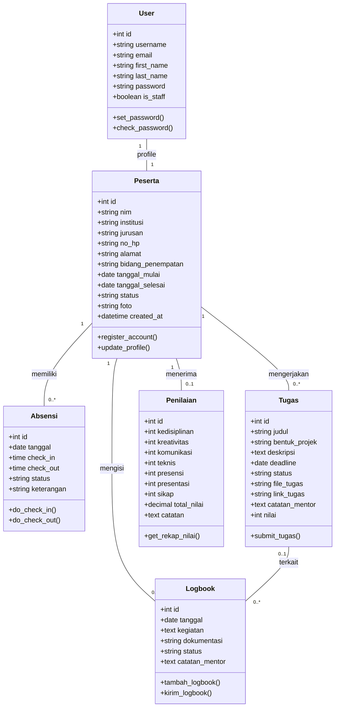
```mermaid
classDiagram
    class User {
        +int id
        +string username
        +string email
        +string first_name
        +string last_name
        +string password
        +boolean is_staff
        +set_password()
        +check_password()
    }

    class Peserta {
        +int id
        +string nim
        +string institusi
        +string jurusan
        +string no_hp
        +string alamat
        +string bidang_penempatan
        +date tanggal_mulai
        +date tanggal_selesai
        +string status
        +string foto
        +datetime created_at
        +register_account()
        +update_profile()
    }

    class Absensi {
        +int id
        +date tanggal
        +time check_in
        +time check_out
        +string status
        +string keterangan
        +do_check_in()
        +do_check_out()
    }

    class Tugas {
        +int id
        +string judul
        +string bentuk_projek
        +text deskripsi
        +date deadline
        +string status
        +string file_tugas
        +string link_tugas
        +text catatan_mentor
        +int nilai
        +submit_tugas()
    }

    class Logbook {
        +int id
        +date tanggal
        +text kegiatan
        +string dokumentasi
        +string status
        +text catatan_mentor
        +tambah_logbook()
        +kirim_logbook()
    }

    class Penilaian {
        +int id
        +int kedisiplinan
        +int kreativitas
        +int komunikasi
        +int teknis
        +int presensi
        +int presentasi
        +int sikap
        +decimal total_nilai
        +text catatan
        +get_rekap_nilai()
    }

    User "1" -- "1" Peserta : profile
    Peserta "1" -- "0..*" Absensi : memiliki
    Peserta "1" -- "0..*" Tugas : mengerjakan
    Peserta "1" -- "0..*" Logbook : mengisi
    Peserta "1" -- "0..1" Penilaian : menerima
    Tugas "0..1" -- "0..*" Logbook : terkait
```

### 2.1.2 Class Diagram - Panel Mentor
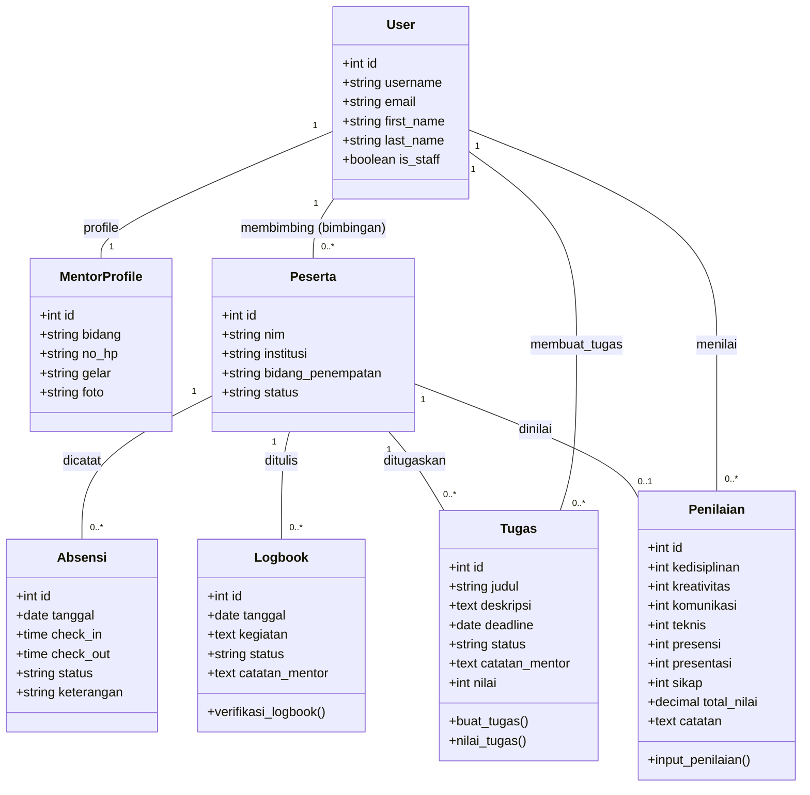
```mermaid
classDiagram
    class User {
        +int id
        +string username
        +string email
        +string first_name
        +string last_name
        +boolean is_staff
    }

    class MentorProfile {
        +int id
        +string bidang
        +string no_hp
        +string gelar
        +string foto
    }

    class Peserta {
        +int id
        +string nim
        +string institusi
        +string bidang_penempatan
        +string status
    }

    class Absensi {
        +int id
        +date tanggal
        +time check_in
        +time check_out
        +string status
        +string keterangan
    }

    class Tugas {
        +int id
        +string judul
        +text deskripsi
        +date deadline
        +string status
        +text catatan_mentor
        +int nilai
        +buat_tugas()
        +nilai_tugas()
    }

    class Logbook {
        +int id
        +date tanggal
        +text kegiatan
        +string status
        +text catatan_mentor
        +verifikasi_logbook()
    }

    class Penilaian {
        +int id
        +int kedisiplinan
        +int kreativitas
        +int komunikasi
        +int teknis
        +int presensi
        +int presentasi
        +int sikap
        +decimal total_nilai
        +text catatan
        +input_penilaian()
    }

    User "1" -- "1" MentorProfile : profile
    User "1" -- "0..*" Peserta : membimbing (bimbingan)
    Peserta "1" -- "0..*" Absensi : dicatat
    User "1" -- "0..*" Tugas : membuat_tugas
    Peserta "1" -- "0..*" Tugas : ditugaskan
    Peserta "1" -- "0..*" Logbook : ditulis
    User "1" -- "0..*" Penilaian : menilai
    Peserta "1" -- "0..1" Penilaian : dinilai
```

### 2.1.3 Class Diagram - Panel Admin
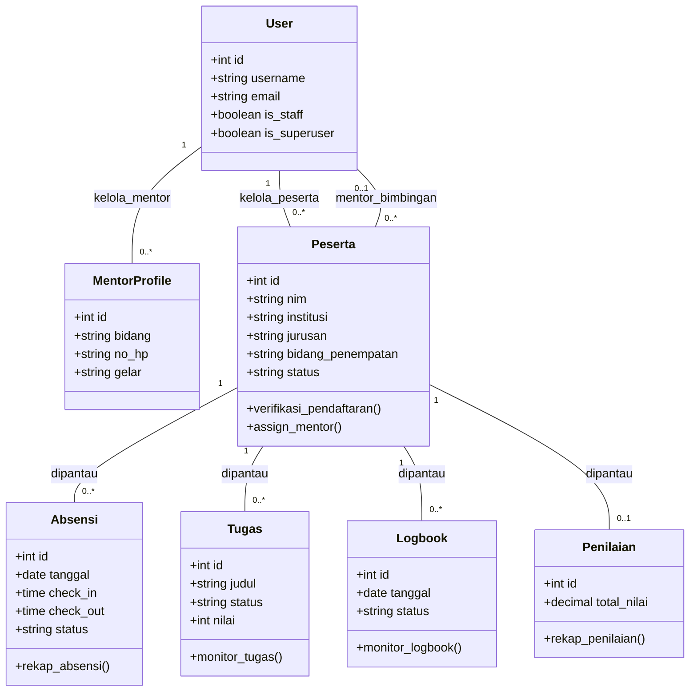
```mermaid
classDiagram
    class User {
        +int id
        +string username
        +string email
        +boolean is_staff
        +boolean is_superuser
    }

    class MentorProfile {
        +int id
        +string bidang
        +string no_hp
        +string gelar
    }

    class Peserta {
        +int id
        +string nim
        +string institusi
        +string jurusan
        +string bidang_penempatan
        +string status
        +verifikasi_pendaftaran()
        +assign_mentor()
    }

    class Absensi {
        +int id
        +date tanggal
        +time check_in
        +time check_out
        +string status
        +rekap_absensi()
    }

    class Tugas {
        +int id
        +string judul
        +string status
        +int nilai
        +monitor_tugas()
    }

    class Logbook {
        +int id
        +date tanggal
        +string status
        +monitor_logbook()
    }

    class Penilaian {
        +int id
        +decimal total_nilai
        +rekap_penilaian()
    }

    User "1" -- "0..*" Peserta : kelola_peserta
    User "1" -- "0..*" MentorProfile : kelola_mentor
    Peserta "0..*" -- "0..1" User : mentor_bimbingan
    Peserta "1" -- "0..*" Absensi : dipantau
    Peserta "1" -- "0..*" Tugas : dipantau
    Peserta "1" -- "0..*" Logbook : dipantau
    Peserta "1" -- "0..1" Penilaian : dipantau
```

---

## 2.2 SEQUENCE DIAGRAM

### 2.2.1 Sequence Diagram - Panel Peserta

#### A. Registrasi Peserta
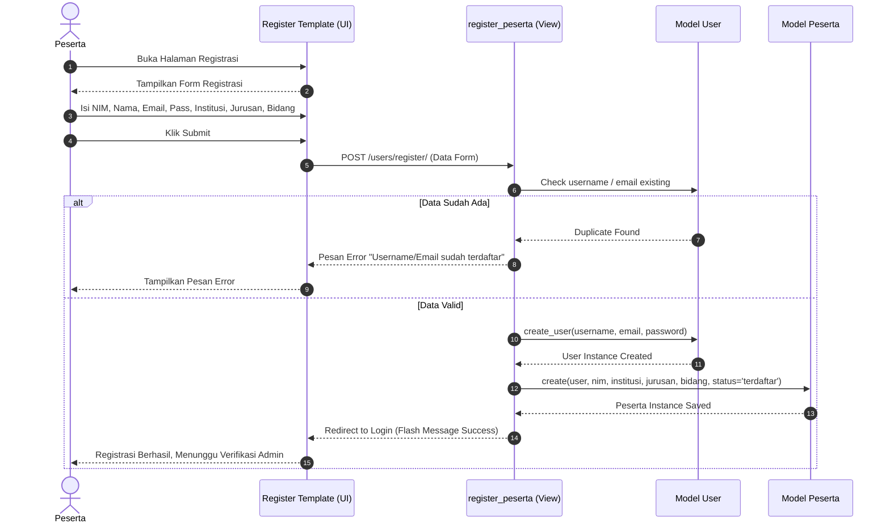
```mermaid
sequenceDiagram
    autonumber
    actor Peserta
    participant Form as Register Template (UI)
    participant View as register_peserta (View)
    participant UserDB as Model User
    participant PesertaDB as Model Peserta

    Peserta->>Form: Buka Halaman Registrasi
    Form-->>Peserta: Tampilkan Form Registrasi
    Peserta->>Form: Isi NIM, Nama, Email, Pass, Institusi, Jurusan, Bidang
    Peserta->>Form: Klik Submit
    Form->>View: POST /users/register/ (Data Form)
    View->>UserDB: Check username / email existing
    alt Data Sudah Ada
        UserDB-->>View: Duplicate Found
        View-->>Form: Pesan Error "Username/Email sudah terdaftar"
        Form-->>Peserta: Tampilkan Pesan Error
    else Data Valid
        View->>UserDB: create_user(username, email, password)
        UserDB-->>View: User Instance Created
        View->>PesertaDB: create(user, nim, institusi, jurusan, bidang, status='terdaftar')
        PesertaDB-->>View: Peserta Instance Saved
        View-->>Form: Redirect to Login (Flash Message Success)
        Form-->>Peserta: Registrasi Berhasil, Menunggu Verifikasi Admin
    end
```

#### B. Login Peserta
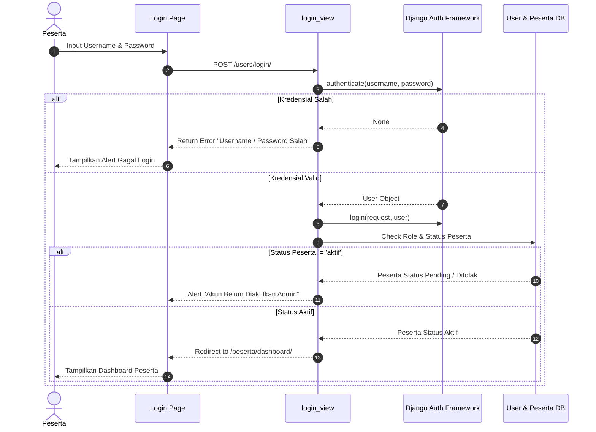
```mermaid
sequenceDiagram
    autonumber
    actor Peserta
    participant UI as Login Page
    participant View as login_view
    participant Auth as Django Auth Framework
    participant DB as User & Peserta DB

    Peserta->>UI: Input Username & Password
    UI->>View: POST /users/login/
    View->>Auth: authenticate(username, password)
    alt Kredensial Salah
        Auth-->>View: None
        View-->>UI: Return Error "Username / Password Salah"
        UI-->>Peserta: Tampilkan Alert Gagal Login
    else Kredensial Valid
        Auth-->>View: User Object
        View->>Auth: login(request, user)
        View->>DB: Check Role & Status Peserta
        alt Status Peserta != 'aktif'
            DB-->>View: Peserta Status Pending / Ditolak
            View-->>UI: Alert "Akun Belum Diaktifkan Admin"
        else Status Aktif
            DB-->>View: Peserta Status Aktif
            View-->>UI: Redirect to /peserta/dashboard/
            UI-->>Peserta: Tampilkan Dashboard Peserta
        end
    end
```

#### C. Presensi Harian (Check-in & Check-out)
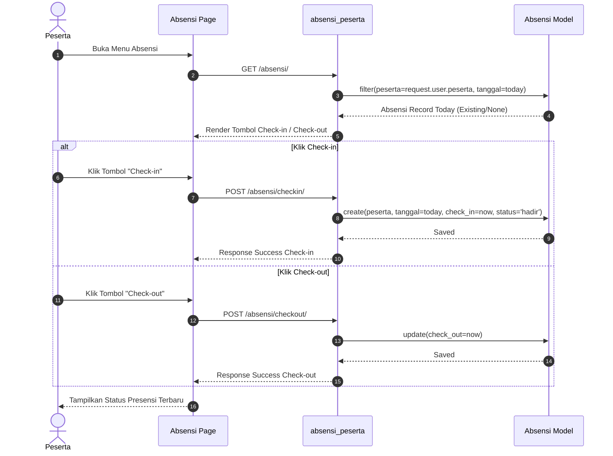
```mermaid
sequenceDiagram
    autonumber
    actor Peserta
    participant UI as Absensi Page
    participant View as absensi_peserta
    participant DB as Absensi Model

    Peserta->>UI: Buka Menu Absensi
    UI->>View: GET /absensi/
    View->>DB: filter(peserta=request.user.peserta, tanggal=today)
    DB-->>View: Absensi Record Today (Existing/None)
    View-->>UI: Render Tombol Check-in / Check-out

    alt Klik Check-in
        Peserta->>UI: Klik Tombol "Check-in"
        UI->>View: POST /absensi/checkin/
        View->>DB: create(peserta, tanggal=today, check_in=now, status='hadir')
        DB-->>View: Saved
        View-->>UI: Response Success Check-in
    else Klik Check-out
        Peserta->>UI: Klik Tombol "Check-out"
        UI->>View: POST /absensi/checkout/
        View->>DB: update(check_out=now)
        DB-->>View: Saved
        View-->>UI: Response Success Check-out
    end
    UI-->>Peserta: Tampilkan Status Presensi Terbaru
```

#### D. Submisi Tugas
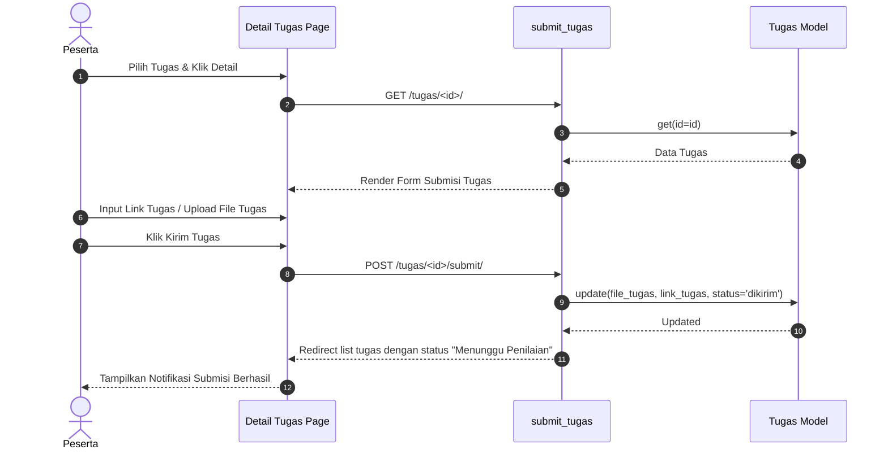
```mermaid
sequenceDiagram
    autonumber
    actor Peserta
    participant UI as Detail Tugas Page
    participant View as submit_tugas
    participant DB as Tugas Model

    Peserta->>UI: Pilih Tugas & Klik Detail
    UI->>View: GET /tugas/<id>/
    View->>DB: get(id=id)
    DB-->>View: Data Tugas
    View-->>UI: Render Form Submisi Tugas

    Peserta->>UI: Input Link Tugas / Upload File Tugas
    Peserta->>UI: Klik Kirim Tugas
    UI->>View: POST /tugas/<id>/submit/
    View->>DB: update(file_tugas, link_tugas, status='dikirim')
    DB-->>View: Updated
    View-->>UI: Redirect list tugas dengan status "Menunggu Penilaian"
    UI-->>Peserta: Tampilkan Notifikasi Submisi Berhasil
```

#### E. Pengisian Logbook Harian
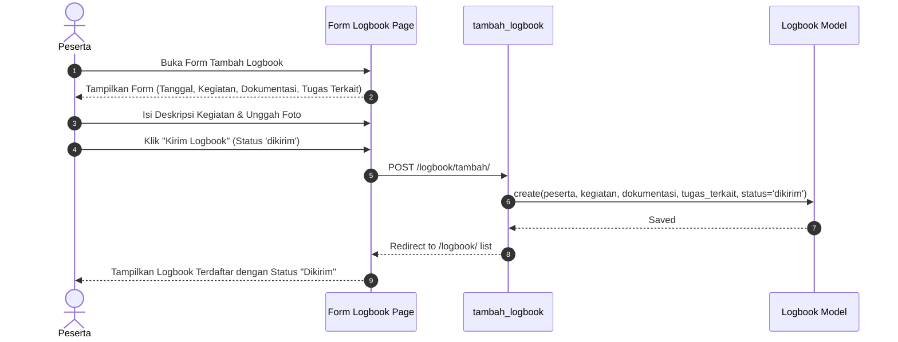
```mermaid
sequenceDiagram
    autonumber
    actor Peserta
    participant UI as Form Logbook Page
    participant View as tambah_logbook
    participant DB as Logbook Model

    Peserta->>UI: Buka Form Tambah Logbook
    UI-->>Peserta: Tampilkan Form (Tanggal, Kegiatan, Dokumentasi, Tugas Terkait)
    Peserta->>UI: Isi Deskripsi Kegiatan & Unggah Foto
    Peserta->>UI: Klik "Kirim Logbook" (Status 'dikirim')
    UI->>View: POST /logbook/tambah/
    View->>DB: create(peserta, kegiatan, dokumentasi, tugas_terkait, status='dikirim')
    DB-->>View: Saved
    View-->>UI: Redirect to /logbook/ list
    UI-->>Peserta: Tampilkan Logbook Terdaftar dengan Status "Dikirim"
```

#### F. Melihat Transkrip Penilaian
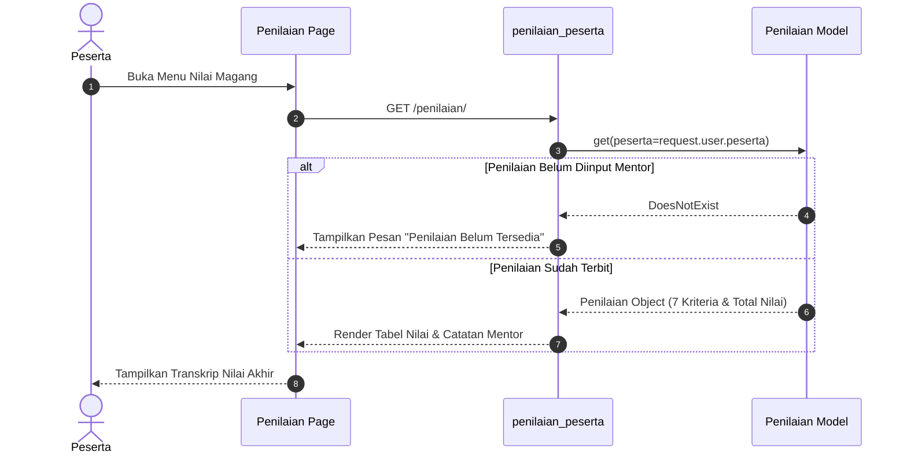
```mermaid
sequenceDiagram
    autonumber
    actor Peserta
    participant UI as Penilaian Page
    participant View as penilaian_peserta
    participant DB as Penilaian Model

    Peserta->>UI: Buka Menu Nilai Magang
    UI->>View: GET /penilaian/
    View->>DB: get(peserta=request.user.peserta)
    alt Penilaian Belum Diinput Mentor
        DB-->>View: DoesNotExist
        View-->>UI: Tampilkan Pesan "Penilaian Belum Tersedia"
    else Penilaian Sudah Terbit
        DB-->>View: Penilaian Object (7 Kriteria & Total Nilai)
        View-->>UI: Render Tabel Nilai & Catatan Mentor
    end
    UI-->>Peserta: Tampilkan Transkrip Nilai Akhir
```

---

### 2.2.2 Sequence Diagram - Panel Mentor

#### A. Login Mentor
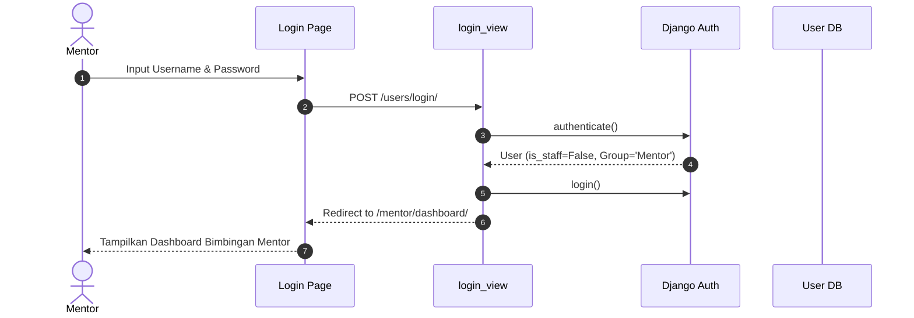
```mermaid
sequenceDiagram
    autonumber
    actor Mentor
    participant UI as Login Page
    participant View as login_view
    participant Auth as Django Auth
    participant DB as User DB

    Mentor->>UI: Input Username & Password
    UI->>View: POST /users/login/
    View->>Auth: authenticate()
    Auth-->>View: User (is_staff=False, Group='Mentor')
    View->>Auth: login()
    View-->>UI: Redirect to /mentor/dashboard/
    UI-->>Mentor: Tampilkan Dashboard Bimbingan Mentor
```

#### B. Presensi & Monitoring Bimbingan
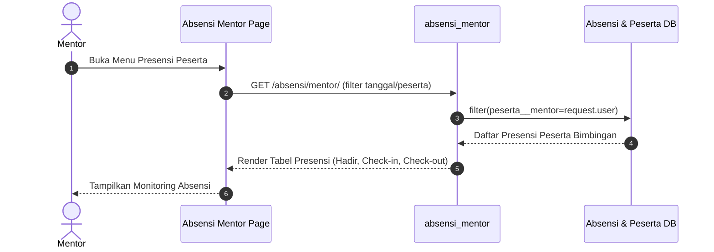
```mermaid
sequenceDiagram
    autonumber
    actor Mentor
    participant UI as Absensi Mentor Page
    participant View as absensi_mentor
    participant DB as Absensi & Peserta DB

    Mentor->>UI: Buka Menu Presensi Peserta
    UI->>View: GET /absensi/mentor/ (filter tanggal/peserta)
    View->>DB: filter(peserta__mentor=request.user)
    DB-->>View: Daftar Presensi Peserta Bimbingan
    View-->>UI: Render Tabel Presensi (Hadir, Check-in, Check-out)
    UI-->>Mentor: Tampilkan Monitoring Absensi
```

#### C. Pembuatan & Penilaian Tugas
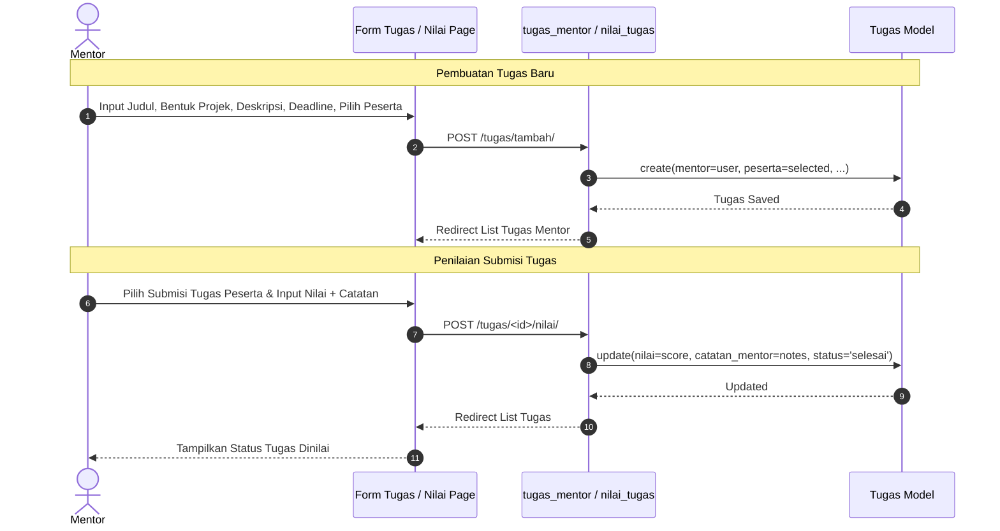
```mermaid
sequenceDiagram
    autonumber
    actor Mentor
    participant UI as Form Tugas / Nilai Page
    participant View as tugas_mentor / nilai_tugas
    participant DB as Tugas Model

    Note over Mentor, DB: Pembuatan Tugas Baru
    Mentor->>UI: Input Judul, Bentuk Projek, Deskripsi, Deadline, Pilih Peserta
    UI->>View: POST /tugas/tambah/
    View->>DB: create(mentor=user, peserta=selected, ...)
    DB-->>View: Tugas Saved
    View-->>UI: Redirect List Tugas Mentor

    Note over Mentor, DB: Penilaian Submisi Tugas
    Mentor->>UI: Pilih Submisi Tugas Peserta & Input Nilai + Catatan
    UI->>View: POST /tugas/<id>/nilai/
    View->>DB: update(nilai=score, catatan_mentor=notes, status='selesai')
    DB-->>View: Updated
    View-->>UI: Redirect List Tugas
    UI-->>Mentor: Tampilkan Status Tugas Dinilai
```

#### D. Verifikasi Logbook Peserta
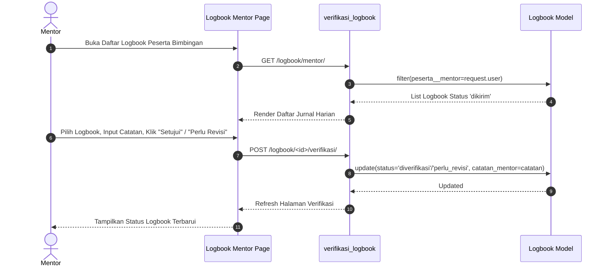
```mermaid
sequenceDiagram
    autonumber
    actor Mentor
    participant UI as Logbook Mentor Page
    participant View as verifikasi_logbook
    participant DB as Logbook Model

    Mentor->>UI: Buka Daftar Logbook Peserta Bimbingan
    UI->>View: GET /logbook/mentor/
    View->>DB: filter(peserta__mentor=request.user)
    DB-->>View: List Logbook Status 'dikirim'
    View-->>UI: Render Daftar Jurnal Harian

    Mentor->>UI: Pilih Logbook, Input Catatan, Klik "Setujui" / "Perlu Revisi"
    UI->>View: POST /logbook/<id>/verifikasi/
    View->>DB: update(status='diverifikasi'/'perlu_revisi', catatan_mentor=catatan)
    DB-->>View: Updated
    View-->>UI: Refresh Halaman Verifikasi
    UI-->>Mentor: Tampilkan Status Logbook Terbarui
```

#### E. Input Evaluasi Penilaian Akhir (7 Kriteria)
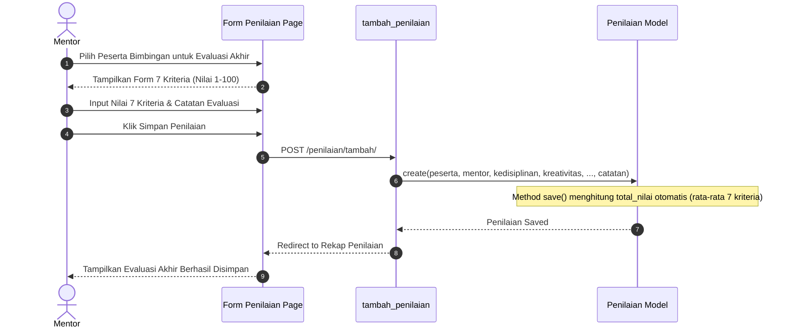
```mermaid
sequenceDiagram
    autonumber
    actor Mentor
    participant UI as Form Penilaian Page
    participant View as tambah_penilaian
    participant DB as Penilaian Model

    Mentor->>UI: Pilih Peserta Bimbingan untuk Evaluasi Akhir
    UI-->>Mentor: Tampilkan Form 7 Kriteria (Nilai 1-100)
    Mentor->>UI: Input Nilai 7 Kriteria & Catatan Evaluasi
    Mentor->>UI: Klik Simpan Penilaian
    UI->>View: POST /penilaian/tambah/
    View->>DB: create(peserta, mentor, kedisiplinan, kreativitas, ..., catatan)
    Note over DB: Method save() menghitung total_nilai otomatis (rata-rata 7 kriteria)
    DB-->>View: Penilaian Saved
    View-->>UI: Redirect to Rekap Penilaian
    UI-->>Mentor: Tampilkan Evaluasi Akhir Berhasil Disimpan
```

---

### 2.2.3 Sequence Diagram - Panel Admin

#### A. Verifikasi Pendaftaran & Assign Mentor
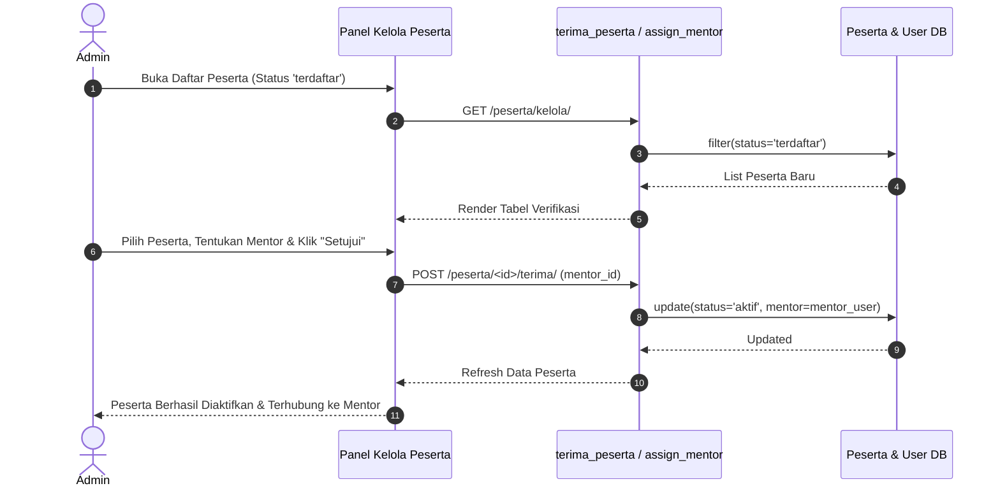
```mermaid
sequenceDiagram
    autonumber
    actor Admin
    participant UI as Panel Kelola Peserta
    participant View as terima_peserta / assign_mentor
    participant DB as Peserta & User DB

    Admin->>UI: Buka Daftar Peserta (Status 'terdaftar')
    UI->>View: GET /peserta/kelola/
    View->>DB: filter(status='terdaftar')
    DB-->>View: List Peserta Baru
    View-->>UI: Render Tabel Verifikasi

    Admin->>UI: Pilih Peserta, Tentukan Mentor & Klik "Setujui"
    UI->>View: POST /peserta/<id>/terima/ (mentor_id)
    View->>DB: update(status='aktif', mentor=mentor_user)
    DB-->>View: Updated
    View-->>UI: Refresh Data Peserta
    UI-->>Admin: Peserta Berhasil Diaktifkan & Terhubung ke Mentor
```

#### B. CRUD Data Mentor
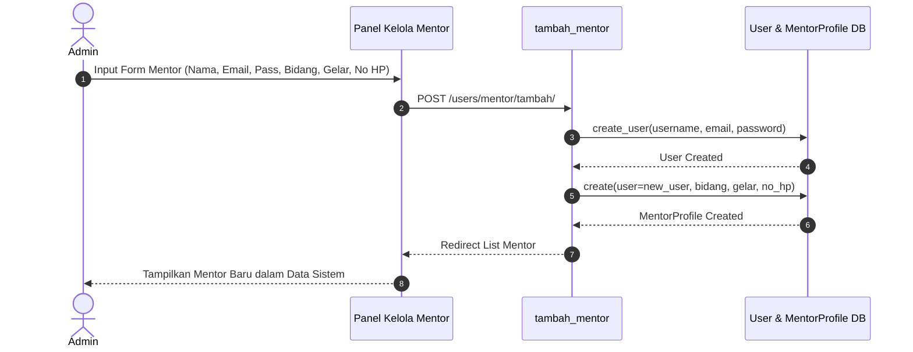
```mermaid
sequenceDiagram
    autonumber
    actor Admin
    participant UI as Panel Kelola Mentor
    participant View as tambah_mentor
    participant DB as User & MentorProfile DB

    Admin->>UI: Input Form Mentor (Nama, Email, Pass, Bidang, Gelar, No HP)
    UI->>View: POST /users/mentor/tambah/
    View->>DB: create_user(username, email, password)
    DB-->>View: User Created
    View->>DB: create(user=new_user, bidang, gelar, no_hp)
    DB-->>View: MentorProfile Created
    View-->>UI: Redirect List Mentor
    UI-->>Admin: Tampilkan Mentor Baru dalam Data Sistem
```

#### C. Monitoring & Ekspor Rekapitulasi Data
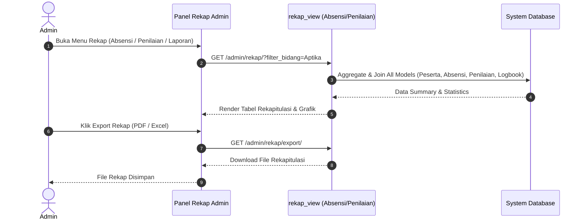
```mermaid
sequenceDiagram
    autonumber
    actor Admin
    participant UI as Panel Rekap Admin
    participant View as rekap_view (Absensi/Penilaian)
    participant DB as System Database

    Admin->>UI: Buka Menu Rekap (Absensi / Penilaian / Laporan)
    UI->>View: GET /admin/rekap/?filter_bidang=Aptika
    View->>DB: Aggregate & Join All Models (Peserta, Absensi, Penilaian, Logbook)
    DB-->>View: Data Summary & Statistics
    View-->>UI: Render Tabel Rekapitulasi & Grafik
    Admin->>UI: Klik Export Rekap (PDF / Excel)
    UI->>View: GET /admin/rekap/export/
    View-->>UI: Download File Rekapitulasi
    UI-->>Admin: File Rekap Disimpan
```

---

## 2.3 ACTIVITY DIAGRAM

### 2.3.1 Activity Diagram - Panel Peserta

#### A. Registrasi & Login Peserta
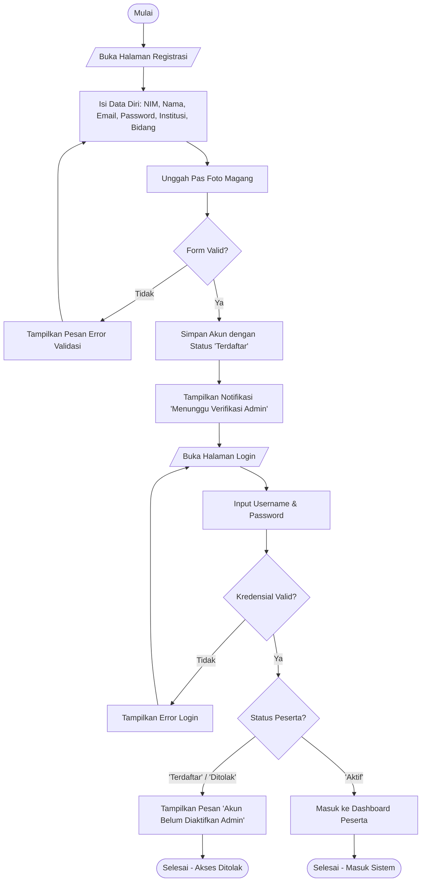
```mermaid
flowchart TD
    Start([Mulai]) --> A[/Buka Halaman Registrasi/]
    A --> B[Isi Data Diri: NIM, Nama, Email, Password, Institusi, Bidang]
    B --> C[Unggah Pas Foto Magang]
    C --> D{Form Valid?}
    D -- Tidak --> E[Tampilkan Pesan Error Validasi]
    E --> B
    D -- Ya --> F[Simpan Akun dengan Status 'Terdaftar']
    F --> G[Tampilkan Notifikasi 'Menunggu Verifikasi Admin']
    G --> H[/Buka Halaman Login/]
    H --> I[Input Username & Password]
    I --> J{Kredensial Valid?}
    J -- Tidak --> K[Tampilkan Error Login]
    K --> H
    J -- Ya --> L{Status Peserta?}
    L -- 'Terdaftar' / 'Ditolak' --> M[Tampilkan Pesan 'Akun Belum Diaktifkan Admin']
    M --> EndPending([Selesai - Akses Ditolak])
    L -- 'Aktif' --> N[Masuk ke Dashboard Peserta]
    N --> EndAktif([Selesai - Masuk Sistem])
```

#### B. Presensi Harian (Absensi)
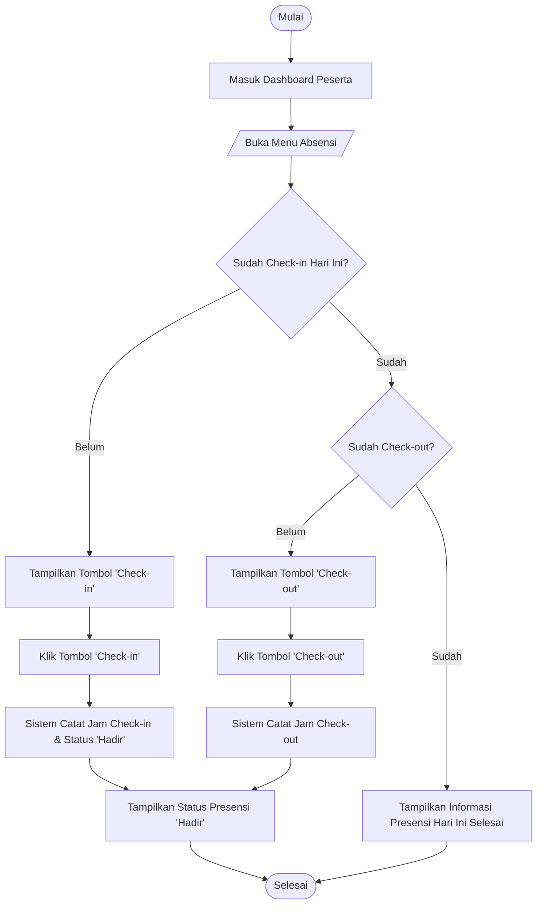
```mermaid
flowchart TD
    Start([Mulai]) --> A[Masuk Dashboard Peserta]
    A --> B[/Buka Menu Absensi/]
    B --> C{Sudah Check-in Hari Ini?}
    C -- Belum --> D[Tampilkan Tombol 'Check-in']
    D --> E[Klik Tombol 'Check-in']
    E --> F[Sistem Catat Jam Check-in & Status 'Hadir']
    F --> G[Tampilkan Status Presensi 'Hadir']
    C -- Sudah --> H{Sudah Check-out?}
    H -- Belum --> I[Tampilkan Tombol 'Check-out']
    I --> J[Klik Tombol 'Check-out']
    J --> K[Sistem Catat Jam Check-out]
    K --> G
    H -- Sudah --> L[Tampilkan Informasi Presensi Hari Ini Selesai]
    L --> End([Selesai])
    G --> End
```

#### C. Pengerjaan & Submisi Tugas
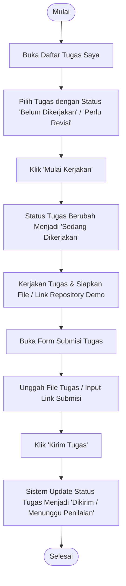
```mermaid
flowchart TD
    Start([Mulai]) --> A[Buka Daftar Tugas Saya]
    A --> B[Pilih Tugas dengan Status 'Belum Dikerjakan' / 'Perlu Revisi']
    B --> C[Klik 'Mulai Kerjakan']
    C --> D[Status Tugas Berubah Menjadi 'Sedang Dikerjakan']
    D --> E[Kerjakan Tugas & Siapkan File / Link Repository Demo]
    E --> F[Buka Form Submisi Tugas]
    F --> G[Unggah File Tugas / Input Link Submisi]
    G --> H[Klik 'Kirim Tugas']
    H --> I[Sistem Update Status Tugas Menjadi 'Dikirim / Menunggu Penilaian']
    I --> End([Selesai])
```

#### D. Pengisian Logbook Harian
```mermaid
flowchart TD
    Start([Mulai]) --> A[Buka Menu Logbook Harian]
    A --> B[Klik 'Tambah Logbook Baru']
    B --> C[Isi Rincian Kegiatan Harian]
    C --> D[Unggah Foto / File Dokumentasi]
    D --> E[Pilih Tugas/Projek Terkait (Opsional)]
    E --> F{Simpan Sebagai?}
    F -- Draft --> G[Simpan Status 'Draft']
    G --> EndDraft([Selesai - Dapat Diedit Kembali])
    F -- Kirim --> H[Simpan Status 'Dikirim']
    H --> EndKirim([Selesai - Menunggu Verifikasi Mentor])
```

#### E. Melihat Penilaian Magang
```mermaid
flowchart TD
    Start([Mulai]) --> A[Buka Menu Penilaian Magang]
    A --> B{Nilai Sudah Diinput Mentor?}
    B -- Belum --> C[Tampilkan Pesan 'Evaluasi Akhir Belum Tersedia']
    C --> EndBelum([Selesai])
    B -- Sudah --> D[Tampilkan Rincian 7 Kriteria Nilai]
    D --> E[Tampilkan Nilai Akhir & Catatan Evaluasi Mentor]
    E --> EndSudah([Selesai])
```

---

### 2.3.2 Activity Diagram - Panel Mentor

#### A. Login & Monitoring Presensi Bimbingan
```mermaid
flowchart TD
    Start([Mulai]) --> A[/Buka Halaman Login/]
    A --> B[Input Username & Password Mentor]
    B --> C{Otentikasi Valid?}
    C -- Tidak --> D[Tampilkan Pesan Error Login]
    D --> A
    C -- Ya --> E[Masuk Dashboard Mentor]
    E --> F[/Buka Menu Absensi Bimbingan/]
    F --> G[Pilih Filter Tanggal / Peserta Magang]
    G --> H[Tampilkan Rekapitulasi Presensi Peserta]
    H --> End([Selesai])
```

#### B. Manajamen & Penilaian Tugas
```mermaid
flowchart TD
    Start([Mulai]) --> A[Buka Menu Manajemen Tugas Mentor]
    A --> B{Pilih Aksi}
    B -- Buat Tugas Baru --> C[Isi Judul, Deskripsi, Deadline & Target Peserta]
    C --> D[Klik 'Kirim Tugas']
    D --> E[Sistem Distribusikan Tugas ke Peserta]
    E --> EndTugas([Selesai])

    B -- Evaluasi Submisi Peserta --> F[Pilih Submisi Tugas Peserta]
    F --> G[Periksa File / Link Hasil Pengerjaan]
    G --> H{Hasil Pengerjaan?}
    H -- Sesuai --> I[Input Nilai & Catatan Apresiasi]
    I --> J[Set Status Tugas 'Selesai']
    J --> EndNilai([Selesai])
    H -- Belum Sesuai --> K[Input Catatan Revisi]
    K --> L[Set Status Tugas 'Perlu Revisi']
    L --> EndNilai
```

#### C. Verifikasi Logbook Peserta
```mermaid
flowchart TD
    Start([Mulai]) --> A[Buka Menu Verifikasi Logbook]
    A --> B[Lihat Daftar Logbook Status 'Dikirim']
    B --> C[Pilih Detail Logbook Peserta]
    C --> D[Tinjau Kegiatan & Dokumentasi]
    D --> E{Apakah Logbook Valid?}
    E -- Valid --> F[Set Status 'Diverifikasi']
    F --> G[Input Catatan Mentor (Opsional)]
    G --> EndVerif([Selesai])
    E -- Perlu Perbaikan --> H[Set Status 'Perlu Revisi']
    H --> I[Input Catatan Revisi Khusus]
    I --> EndVerif
```

#### D. Input Penilaian Akhir Magang (7 Kriteria)
```mermaid
flowchart TD
    Start([Mulai]) --> A[Buka Menu Penilaian Peserta Bimbingan]
    A --> B[Pilih Peserta Magang yang Di-evaluasi]
    B --> C[Input Skor (1-100) 7 Kriteria: Kedisiplinan, Kreativitas, Komunikasi, Teknis, Presensi, Presentasi, Sikap]
    C --> D[Input Catatan Evaluasi & Kesimpulan Magang]
    D --> E[Klik 'Simpan Penilaian']
    E --> F[Sistem Hitung Otomatis Total Nilai Rata-Rata (7 Kriteria)]
    F --> G[Simpan Record Penilaian ke Database]
    G --> End([Selesai])
```

---

### 2.3.3 Activity Diagram - Panel Admin

#### A. Verifikasi Registrasi Peserta & Assign Mentor
```mermaid
flowchart TD
    Start([Mulai]) --> A[Login Admin & Masuk Dashboard]
    A --> B[/Buka Menu Kelola Peserta/]
    B --> C[Lihat Daftar Peserta Status 'Terdaftar']
    C --> D[Pilih Detail Peserta]
    D --> E{Keputusan Verifikasi?}
    E -- Tolak --> F[Ubah Status Menjadi 'Ditolak']
    F --> G[Simpan Status]
    G --> EndTolak([Selesai - Peserta Ditolak])
    E -- Terima --> H[Ubah Status Menjadi 'Aktif']
    H --> I[Pilih Mentor Bimbingan untuk Peserta]
    I --> J[Simpan Perubahan & Hubungkan Peserta-Mentor]
    J --> EndTerima([Selesai - Peserta Aktif])
```

#### B. Kelola Data Mentor (CRUD)
```mermaid
flowchart TD
    Start([Mulai]) --> A[Buka Menu Kelola Mentor]
    A --> B{Pilih Operasi Data}
    B -- Tambah Mentor --> C[Isi Form Akun Mentor & Bidang Penempatan]
    C --> D[Simpan Akun Mentor Baru]
    D --> End([Selesai])
    B -- Edit Mentor --> E[Pilih Mentor & Perbarui Data/Gelar/Bidang]
    E --> F[Simpan Perubahan]
    F --> End
    B -- Hapus Mentor --> G[Konfirmasi Hapus Mentor]
    G --> H[Hapus Account & Disconnect Relasi Bimbingan]
    H --> End
```

#### C. Rekapitulasi & Monitoring Sistem
```mermaid
flowchart TD
    Start([Mulai]) --> A[Buka Menu Rekapitulasi System Admin]
    A --> B[Pilih Jenis Rekap: Absensi / Tugas / Logbook / Penilaian]
    B --> C[Terapkan Filter: Bidang / Rentang Tanggal / Status Peserta]
    C --> D[Sistem Tampilkan Statistik & Tabel Data Terintegrasi]
    D --> E{Ingin Cetak / Export Data?}
    E -- Tidak --> EndLihat([Selesai - Hanya Memantau])
    E -- Ya --> F[Klik Export PDF / Excel]
    F --> G[Sistem Generate Dokumen Laporan]
    G --> H[/Download File Rekapitulasi/]
    H --> EndExport([Selesai - Laporan Unduh])
```

---

# BAB 3: RANCANGAN & HASIL PENGUJIAN BLACK-BOX TESTING

## 3.1 Pendahuluan & Ringkasan Pengujian
Pengujian *Black-Box Testing* ini bertujuan untuk memastikan seluruh fungsionalitas antarmuka dan logika bisnis aplikasi **Sistem Manajemen Magang** berjalan 100% sesuai spesifikasi pengguna.

### Rekapitulasi Hasil Pengujian (Pass Rate: 100%)
| No | Modul / Fitur Sistem | Jumlah Test Case | Pass | Fail | Persentase Keberhasilan |
|---|---|:---:|:---:|:---:|:---:|
| 1 | Autentikasi & Registrasi | 6 | 6 | 0 | 100% |
| 2 | Manajemen Peserta & Mentor | 6 | 6 | 0 | 100% |
| 3 | Presensi & Absensi Harian | 5 | 5 | 0 | 100% |
| 4 | Manajemen Tugas & Submisi | 6 | 6 | 0 | 100% |
| 5 | Jurnal Logbook Harian | 5 | 5 | 0 | 100% |
| 6 | Penilaian Evaluasi Akhir | 4 | 4 | 0 | 100% |
| 7 | Manajemen Projek Magang | 3 | 3 | 0 | 100% |
| 8 | Laporan & Ekspor Data Excel | 3 | 3 | 0 | 100% |
| **TOTAL** | **Seluruh Fitur Sistem** | **38** | **38** | **0** | **100%** |

---

## 3.2 Tabel Detail Black-Box Testing

### Tabel 3.2.1: Modul Autentikasi & Registrasi Akun
| Kode Test | Skenario Pengujian | Masukan Data (Test Input) | Hasil yang Diharapkan | Hasil Pengujian (Actual Output) | Status |
|---|---|---|---|---|:---:|
| **BB-AUTH-01** | Registrasi Akun Peserta Baru dengan Data Valid | NIM: `210101`, Nama: `Budi`, Email: `budi@gmail.com`, Pass: `Pass123!`, Bidang: `Aptika` | Sistem menyimpan data pendaftaran ke basis data dengan status `terdaftar` (pending) dan mengarahkan pengguna ke halaman login dengan notifikasi sukses. | Data pendaftaran berhasil disimpan, status akun `terdaftar`, dan notifikasi sukses ditampilkan pada halaman login. | **Pass** |
| **BB-AUTH-02** | Registrasi Akun dengan NIM/Email yang Sudah Terdaftar | NIM yang sudah ada: `210101` atau Email yang sudah ada | Sistem menolak proses registrasi dan menampilkan pesan kesalahan validasi "NIM atau Email sudah terdaftar dalam sistem". | Sistem menampilkan alert kesalahan validasi dan pendaftaran ditolak. | **Pass** |
| **BB-AUTH-03** | Login Peserta dengan Status Akun `Aktif` | Username: `budi`, Password: `Pass123!` | Sistem memverifikasi kredensial, membuat sesi login (*session*), dan mengarahkan pengguna ke Dashboard Peserta (`/users/dashboard/peserta/`). | Pengguna berhasil diotentikasi dan diarahkan ke Dashboard Peserta. | **Pass** |
| **BB-AUTH-04** | Login Peserta dengan Status Akun Masih `Terdaftar` (Pending) | Username: `budi_pending`, Password: `Pass123!` | Sistem menolak hak akses masuk dan menampilkan notifikasi "Akun Anda belum disetujui/diaktifkan oleh Administrator atau Mentor". | Akses ditolak, pengguna tetap berada di halaman login dengan notifikasi peringatan. | **Pass** |
| **BB-AUTH-05** | Login dengan Kredensial Password Salah | Username: `budi`, Password: `WrongPassword!` | Sistem menolak login dan menampilkan pesan kesalahan "Username atau Password yang Anda masukkan salah". | Notifikasi kesalahan kredensial berhasil ditampilkan. | **Pass** |
| **BB-AUTH-06** | Fitur Logout Pengguna | Klik tombol "Logout" pada bar navigasi | Sesi autentikasi pengguna dihapus secara aman dari server dan halaman dialihkan ke antarmuka login utama. | Sesi terhapus dan halaman login ditampilkan. | **Pass** |

---

### Tabel 3.2.2: Modul Kelola Peserta & Mentor (Admin & Mentor)
| Kode Test | Skenario Pengujian | Masukan Data (Test Input) | Hasil yang Diharapkan | Hasil Pengujian (Actual Output) | Status |
|---|---|---|---|---|:---:|
| **BB-USER-01** | Pembuatan Data Mentor Baru oleh Admin | Username: `mentor_aptika`, Pass: `Mentor123!`, Bidang: `Aptika`, Gelar: `S.Kom.` | Admin berhasil membuat akun User baru dan instance `MentorProfile` yang terhubung di basis data. | Data mentor baru berhasil ditambahkan dan tampil pada daftar mentor. | **Pass** |
| **BB-USER-02** | Verifikasi & Persetujuan (Approve) Peserta Magang | Pilih Peserta `terdaftar`, Klik "Terima/Approve", Alokasikan Mentor Pembimbing | Status Peserta berubah menjadi `aktif`, relasi `ForeignKey` mentor bimbingan terhubung, dan peserta dapat mengakses sistem. | Status peserta terbarui menjadi `aktif` dan relasi mentor terhubung. | **Pass** |
| **BB-USER-03** | Penolakan (Reject) Pendaftaran Peserta Magang | Pilih Peserta `terdaftar`, Klik "Tolak/Reject" | Status Peserta berubah menjadi `ditolak` dan peserta tidak dapat melakukan registrasi ulang dengan NIM sama. | Status pendaftaran peserta berubah menjadi `ditolak`. | **Pass** |
| **BB-USER-04** | Pembaharuan Data Profil Mentor oleh Admin | Edit No. HP, Gelar Akademik, atau Bidang Penempatan Mentor | Data profil mentor ter-update pada basis data dan menampilkan data terbaru pada antarmuka. | Perubahan data mentor berhasil tersimpan secara presisi. | **Pass** |
| **BB-USER-05** | Penghapusan Data Mentor | Klik tombol "Hapus" pada baris data Mentor | Akun mentor terhapus dari basis data dan relasi bimbingan peserta dialihkan menjadi `NULL` tanpa merusak integritas data peserta. | Akun mentor terhapus aman tanpa menyebabkan *database constraint error*. | **Pass** |
| **BB-USER-06** | Pembaruan Profil Mandiri Pengguna (Edit Profile) | Unggah foto profil baru (`.png`), ubah No. HP & Alamat | File foto profil terunggah ke direktori `media/` dan informasi kontak terbarui di sistem. | Foto profil dan info kontak pengguna berhasil ter-update. | **Pass** |

---

### Tabel 3.2.3: Modul Presensi & Absensi Harian
| Kode Test | Skenario Pengujian | Masukan Data (Test Input) | Hasil yang Diharapkan | Hasil Pengujian (Actual Output) | Status |
|---|---|---|---|---|:---:|
| **BB-ABS-01** | Pencatatan Kehadiran (Check-in) Peserta | Klik tombol "Check-in" pada hari berjalan | Jam check-in tercatat otomatis sesuai waktu server, status kehadiran diset menjadi `hadir`. | Waktu check-in tercatat presisi dan status berubah menjadi `hadir`. | **Pass** |
| **BB-ABS-02** | Validasi Presensi Ganda (Duplicate Check-in) | Klik tombol "Check-in" kembali pada tanggal yang sama | Sistem mencegah pencatatan ulang berdasarkan *unique constraint* `['peserta', 'tanggal']` dan menonaktifkan tombol check-in. | Sistem menolak input presensi kedua dan menampilkan status sudah check-in. | **Pass** |
| **BB-ABS-03** | Pencatatan Jam Pulang (Check-out) Peserta | Klik tombol "Check-out" setelah melakukan check-in | Jam check-out tercatat pada rekapitulasi presensi harian peserta terkait. | Jam check-out berhasil disimpan di basis data. | **Pass** |
| **BB-ABS-04** | Monitoring Presensi Bimbingan oleh Mentor | Akses menu `/absensi/mentor/` | Menampilkan tabel presensi seluruh peserta magang yang berada di bawah bimbingan mentor login. | Rekapitulasi absensi peserta bimbingan ditampilkan lengkap. | **Pass** |
| **BB-ABS-05** | Pengubahan Status Absensi Peserta oleh Admin | Ubah status dari `hadir` menjadi `sakit` / `izin` + isi keterangan | Record absensi terbarui sesuai masukan Admin dan rekapitulasi jumlah kehadiran ter-update. | Status absensi dan catatan keterangan berhasil disesuaikan. | **Pass** |

---

### Tabel 3.2.4: Modul Manajemen Tugas & Submisi
| Kode Test | Skenario Pengujian | Masukan Data (Test Input) | Hasil yang Diharapkan | Hasil Pengujian (Actual Output) | Status |
|---|---|---|---|---|:---:|
| **BB-TGS-01** | Pembuatan Tugas Baru oleh Mentor | Judul: `Integrasi API`, Deskripsi: `Buat modul...`, Deadline: `2026-08-15`, Target: `Peserta A` | Tugas baru tersimpan dengan status awal `belum` dan secara otomatis tampil di Dashboard Peserta A. | Tugas berhasil terdistribusi ke akun peserta target. | **Pass** |
| **BB-TGS-02** | Inisiasi Pengerjaan Tugas oleh Peserta | Klik tombol "Kerjakan Tugas" pada daftar tugas | Status tugas otomatis diperbarui dari `belum` menjadi `proses` (Sedang Dikerjakan). | Status pengerjaan tugas berubah menjadi `proses`. | **Pass** |
| **BB-TGS-03** | Penyerahan (Submit) Submisi Tugas Peserta | Input Link Repository: `https://github.com/...`, Upload File Submisi | File/link submisi tersimpan di server dan status tugas berubah menjadi `dikirim` (Menunggu Penilaian). | Submisi tugas terunggah dan status menjadi `dikirim`. | **Pass** |
| **BB-TGS-04** | Penilaian & Apresiasi Tugas oleh Mentor | Input Nilai: `90`, Catatan: `Hasil kerja sangat rapi`, Status: `selesai` | Nilai dan umpan balik mentor tersimpan, status tugas berubah menjadi `selesai` (Dinilai). | Tugas terbukti dinilai dan nilai tampil di antarmuka peserta. | **Pass** |
| **BB-TGS-05** | Permintaan Revisi Tugas oleh Mentor | Input Catatan: `Perbaiki penulisan dokumentasi`, Status: `perlu_revisi` | Status tugas berubah menjadi `perlu_revisi` dan form penyerahan tugas terbuka kembali untuk peserta. | Peserta menerima status revisi dan dapat mengunggah ulang tugas. | **Pass** |
| **BB-TGS-06** | Perpanjangan Tanggal Tenggat (Edit Deadline) Tugas | Ubah tanggal deadline pada form edit tugas mentor | Tanggal batas akhir penyerahan tugas terbarui pada antarmuka mentor dan peserta. | Tanggal tenggat tugas berhasil diperbarui. | **Pass** |

---

### Tabel 3.2.5: Modul Jurnal Logbook Harian
| Kode Test | Skenario Pengujian | Masukan Data (Test Input) | Hasil yang Diharapkan | Hasil Pengujian (Actual Output) | Status |
|---|---|---|---|---|:---:|
| **BB-LOG-01** | Pengisian Logbook Harian sebagai Draf | Uraian Kegiatan: `Studi Literatur`, Pilih Simpan: `Draft` | Jurnal logbook tersimpan dengan status `draft` dan masih dapat disunting ulang oleh Peserta. | Record logbook status `draft` tersimpan di basis data. | **Pass** |
| **BB-LOG-02** | Pengiriman Logbook Dilengkapi Dokumentasi | Unggah Foto Kegiatan (`.jpg`), Uraian: `Implementasi UI`, Simpan: `Dikirim` | File dokumentasi terunggah ke direktori `media/logbook/` dan status logbook berubah menjadi `dikirim`. | Logbook berstatus `dikirim` dan tampil pada antarmuka verifikasi mentor. | **Pass** |
| **BB-LOG-03** | Verifikasi Logbook oleh Mentor | Klik tombol "Setujui/Verifikasi" + isi catatan apresiasi | Status logbook berubah dari `dikirim` menjadi `diverifikasi` dan catatan mentor tersimpan. | Logbook ter-update menjadi `diverifikasi`. | **Pass** |
| **BB-LOG-04** | Permintaan Revisi Logbook oleh Mentor | Klik tombol "Minta Revisi" + masukan catatan perbaikan | Status logbook berubah menjadi `perlu_revisi` dan notifikasi revisi tampil pada akun peserta. | Catatan revisi mentor berhasil terintegrasi pada logbook peserta. | **Pass** |
| **BB-LOG-05** | Pembaharuan Logbook Pasca Revisi | Perbarui uraian kegiatan & unggah ulang foto dokumentasi | Data logbook ter-update dan status kembali siap untuk diverifikasi ulang oleh mentor. | Logbook berhasil diperbarui oleh peserta. | **Pass** |

---

### Tabel 3.2.6: Modul Penilaian Evaluasi Akhir (7 Kriteria)
| Kode Test | Skenario Pengujian | Masukan Data (Test Input) | Hasil yang Diharapkan | Hasil Pengujian (Actual Output) | Status |
|---|---|---|---|---|:---:|
| **BB-NIL-01** | Input Evaluasi Akhir 7 Kriteria oleh Mentor | Disiplin: `85`, Kreativitas: `90`, Komunikasi: `80`, Teknis: `95`, Presensi: `90`, Presentasi: `85`, Sikap: `90` | Metode `save()` pada Model menghitung otomatis rata-rata `total_nilai = 87.86` dan menyimpan evaluasi. | Sistem mengkalkulasi `total_nilai` secara akurat (87.86) dan menyimpan data penilaian. | **Pass** |
| **BB-NIL-02** | Validasi Batas Skala Nilai (Out of Range Input) | Input nilai `150` atau `-10` pada salah satu kriteria | Form validasi HTML5 / Django Form menolak masukan dan menampilkan pesan batas nilai (0 - 100). | Input di luar batas ditolak dan form menampilkan pesan kesalahan. | **Pass** |
| **BB-NIL-03** | Perubahan Data Penilaian (Edit Evaluasi) | Ubah skor Nilai Teknis dari `95` menjadi `98` | Record penilaian diperbarui dan nilai rata-rata `total_nilai` dihitung ulang secara otomatis. | `total_nilai` terkalkulasi ulang secara otomatis dan presisi. | **Pass** |
| **BB-NIL-04** | Transkrip Penilaian Akhir oleh Peserta | Akses menu `/penilaian/` pada akun Peserta | Antarmuka menampilkan rincian nilai 7 kriteria, total nilai rata-rata, serta catatan evaluasi mentor. | Transkrip nilai akhir magang ditampilkan secara utuh dan rapi. | **Pass** |

---

### Tabel 3.2.7: Modul Projek Magang & Laporan Ekspor Data
| Kode Test | Skenario Pengujian | Masukan Data (Test Input) | Hasil yang Diharapkan | Hasil Pengujian (Actual Output) | Status |
|---|---|---|---|---|:---:|
| **BB-PRJ-01** | Pengelolaan Informasi Projek Magang | Judul: `SIP-Magang`, Penjelasan: `Web App`, Link Repo: `https://github.com/...` | Data projek tersimpan dan terhubung ke profil peserta (`OneToOneField`). | Data projek magang berhasil disimpan dan ditampilkan di detail projek. | **Pass** |
| **BB-PRJ-02** | Sinkronisasi Otomatis Tugas ke Projek Magang | Klik tombol "Kerjakan" pada tugas berjenis projek | Informasi judul & deskripsi tugas ter-synchronize otomatis ke data projek peserta tanpa menimpa data manual. | Sinkronisasi otomatis berjalan sukses. | **Pass** |
| **BB-LAP-01** | Ekspor Rekapitulasi Data Magang ke Format Excel | Klik tombol "Export Excel Admin" / "Export Excel Peserta" | Sistem meregenerasi dan mengunduh berkas spreadsheet `.xlsx` berisi rekapitulasi data presensi, logbook, dan nilai. | File `.xlsx` tergenerate dengan struktur data lengkap dan terunduh lancar. | **Pass** |

---
*Dokumen Terintegrasi Perancangan Sistem, Arsitektur UML, dan Black-Box Testing ini disusun secara resmi untuk Sistem Manajemen Magang.*
