# PERANCANGAN CODE PLAN & DIAGRAM UML LENGKAP
## SISTEM MANAJEMEN MAGANG (DJANGO FRAMEWORK)

---

## 1. CODE PLAN & ARSITEKTUR SISTEM

### 1.1 Model-Template-View (MTV) Architecture
Sistem Manajemen Magang dibangun menggunakan kerangka kerja **Django** berbasis bahasa pemrograman Python dengan arsitektur **Model-Template-View (MTV)**:

- **Model Layer (`models.py`)**: Mengelola struktur skema basis data RDBMS (SQLite / MySQL), entitas data, validasi, dan hubungan antarentitas (ORM Django).
- **View/Controller Layer (`views.py`)**: Menangani *business logic*, pengolahan request/response HTTP, otentikasi akun, serta otorisasi hak akses berbasis peran (*Role-Based Access Control / RBAC*) untuk Admin, Mentor, dan Peserta.
- **Template Layer (`templates/*.html`)**: Mengelola antarmuka pengguna (UI/UX) yang dinamis dan responsif menggunakan HTML5, Vanilla CSS, JavaScript, serta *Django Template Language* (DTL).

### 1.2 Struktur Modul Aplikasi
Aplikasi ini terbagi menjadi 8 modul utama yang terintegrasi secara modular:

1. **`users`**: Mengelola otentikasi (login, logout), manajemen pengguna Django, serta ekstensi profil mentor (`MentorProfile`).
2. **`peserta`**: Mengelola data biodata peserta magang (`Peserta`), status pendaftaran (`terdaftar`, `aktif`, `ditolak`, `selesai`), serta pemetaan mentor bimbingan.
3. **`absensi`**: Pencatatan presensi harian (`Absensi`), fitur *check-in*, *check-out*, status kehadiran (`hadir`, `sakit`, `izin`, `alpha`), dan rekapitulasi kehadiran.
4. **`tugas`**: Pembagian tugas dan projek (`Tugas`), penyerahan hasil tugas (*submission link/file*), status progres, serta penilaian tugas oleh mentor.
5. **`logbook`**: Jurnal kegiatan harian peserta (`Logbook`), pengunggahan foto dokumentasi, keterkaitan dengan tugas, serta verifikasi dan revisi oleh mentor.
6. **`penilaian`**: Evaluasi akhir peserta magang (`Penilaian`) berbasis 7 kriteria standar (Kedisiplinan, Kreativitas, Komunikasi, Teknis, Presensi, Presentasi, Sikap) dengan perhitungan otomatis `total_nilai`.
7. **`projek`**: Pengelolaan informasi projek magang individu/kelompok (`ProjekMagang`) mencakup repositori GitHub, demo aplikasi, dan dokumentasi teknis.
8. **`laporan`**: Cetak dan ekspor rekapitulasi laporan magang secara menyeluruh dalam format PDF / Excel.

---

## 2. ENTITY RELATIONSHIP DIAGRAM (ERD)

Diagram ini menggambarkan hubungan struktural antar tabel/entitas dalam basis data Sistem Manajemen Magang.

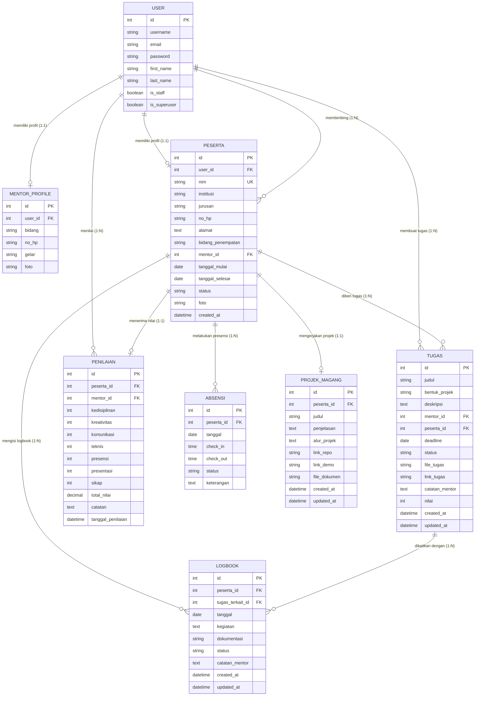
```mermaid
erDiagram
    USER ||--o| MENTOR_PROFILE : "memiliki profil (1:1)"
    USER ||--o| PESERTA : "memiliki profil (1:1)"
    USER ||--o{ PESERTA : "membimbing (1:N)"
    USER ||--o{ TUGAS : "membuat tugas (1:N)"
    USER ||--o{ PENILAIAN : "menilai (1:N)"

    PESERTA ||--o{ ABSENSI : "melakukan presensi (1:N)"
    PESERTA ||--o{ TUGAS : "diberi tugas (1:N)"
    PESERTA ||--o{ LOGBOOK : "mengisi logbook (1:N)"
    PESERTA ||--o| PENILAIAN : "menerima nilai (1:1)"
    PESERTA ||--o| PROJEK_MAGANG : "mengerjakan projek (1:1)"

    TUGAS ||--o{ LOGBOOK : "dikaitkan dengan (1:N)"

    USER {
        int id PK
        string username
        string email
        string password
        string first_name
        string last_name
        boolean is_staff
        boolean is_superuser
    }

    MENTOR_PROFILE {
        int id PK
        int user_id FK
        string bidang
        string no_hp
        string gelar
        string foto
    }

    PESERTA {
        int id PK
        int user_id FK
        string nim UK
        string institusi
        string jurusan
        string no_hp
        text alamat
        string bidang_penempatan
        int mentor_id FK
        date tanggal_mulai
        date tanggal_selesai
        string status
        string foto
        datetime created_at
    }

    ABSENSI {
        int id PK
        int peserta_id FK
        date tanggal
        time check_in
        time check_out
        string status
        text keterangan
    }

    TUGAS {
        int id PK
        string judul
        string bentuk_projek
        text deskripsi
        int mentor_id FK
        int peserta_id FK
        date deadline
        string status
        string file_tugas
        string link_tugas
        text catatan_mentor
        int nilai
        datetime created_at
        datetime updated_at
    }

    LOGBOOK {
        int id PK
        int peserta_id FK
        int tugas_terkait_id FK
        date tanggal
        text kegiatan
        string dokumentasi
        string status
        text catatan_mentor
        datetime created_at
        datetime updated_at
    }

    PENILAIAN {
        int id PK
        int peserta_id FK
        int mentor_id FK
        int kedisiplinan
        int kreativitas
        int komunikasi
        int teknis
        int presensi
        int presentasi
        int sikap
        decimal total_nilai
        text catatan
        datetime tanggal_penilaian
    }

    PROJEK_MAGANG {
        int id PK
        int peserta_id FK
        string judul
        text penjelasan
        text alur_projek
        string link_repo
        string link_demo
        string file_dokumen
        datetime created_at
        datetime updated_at
    }
```

### Penjelasan Relasi ERD:
1. **User - MentorProfile (1:1)**: Setiap user yang berperan sebagai Mentor memiliki 1 profil tambahan (`MentorProfile`) berisi data bidang, gelar, dan no HP.
2. **User - Peserta (1:1)**: Setiap user yang mendaftar sebagai Peserta terhubung 1-to-1 dengan tabel `Peserta` yang memuat identitas NIM, kampus, dan status magang.
3. **User (Mentor) - Peserta (1:N)**: Seorang Mentor dapat membimbing banyak Peserta Magang (`bimbingan`), sedangkan Peserta hanya memiliki 1 Mentor Pembimbing.
4. **Peserta - Absensi (1:N)**: Peserta memiliki banyak catatan presensi harian di tabel `Absensi` (*unique constraint* pada kombinasi `peserta` dan `tanggal`).
5. **Peserta - Tugas (1:N)** & **Mentor - Tugas (1:N)**: Mentor dapat membuat banyak tugas untuk peserta tertentu. Satu peserta dapat memiliki banyak daftar tugas.
6. **Peserta - Logbook (1:N)** & **Tugas - Logbook (1:N)**: Peserta mengisi logbook harian, di mana logbook tersebut opsional dapat ditautkan (*foreign key*) ke tugas yang sedang dikerjakan.
7. **Peserta - Penilaian (1:1)**: Peserta menerima 1 hasil evaluasi nilai akhir magang dari mentor pembimbing.
8. **Peserta - ProjekMagang (1:1)**: Peserta mengelola 1 projek utama magang beserta repositori dan file pendukungnya.

---

## 3. USE CASE DIAGRAM

### 3.1 Overview Integrated Use Case Diagram
Diagram ini menggambarkan batas sistem (*system boundary*) beserta hubungan interaksi antara ketiga aktor utama: **Peserta**, **Mentor**, dan **Admin**.

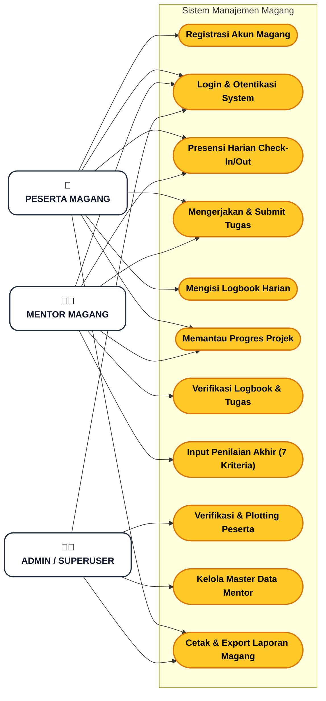
```mermaid
flowchart LR
    classDef actorStyle fill:#ffffff,stroke:#1e293b,stroke-width:2px,rx:15px,color:#0f172a;
    classDef ucStyle fill:#ffca28,stroke:#d97706,stroke-width:2px,color:#000000,font-weight:bold;

    %% Left Actor
    Peserta["🧍<br/><b>PESERTA MAGANG</b>"]:::actorStyle

    %% System Boundary Box (Tengah)
    subgraph SystemBoundary["Sistem Manajemen Magang"]
        direction TB
        UC1(["Registrasi Akun Magang"]):::ucStyle
        UC2(["Login & Otentikasi System"]):::ucStyle
        UC3(["Presensi Harian Check-In/Out"]):::ucStyle
        UC4(["Mengerjakan & Submit Tugas"]):::ucStyle
        UC5(["Mengisi Logbook Harian"]):::ucStyle
        UC6(["Memantau Progres Projek"]):::ucStyle
        UC7(["Verifikasi Logbook & Tugas"]):::ucStyle
        UC8(["Input Penilaian Akhir (7 Kriteria)"]):::ucStyle
        UC9(["Verifikasi & Plotting Peserta"]):::ucStyle
        UC10(["Kelola Master Data Mentor"]):::ucStyle
        UC11(["Cetak & Export Laporan Magang"]):::ucStyle
    end

    %% Right Actors
    Mentor["👨‍🏫<br/><b>MENTOR MAGANG</b>"]:::actorStyle
    Admin["👨‍💼<br/><b>ADMIN / SUPERUSER</b>"]:::actorStyle

    %% Relasi Peserta (Kiri)
    Peserta --> UC1
    Peserta --> UC2
    Peserta --> UC3
    Peserta --> UC4
    Peserta --> UC5
    Peserta --> UC6
    Peserta --> UC11

    %% Relasi Mentor (Kanan)
    Mentor --> UC2
    Mentor --> UC3
    Mentor --> UC4
    Mentor --> UC7
    Mentor --> UC8
    Mentor --> UC6

    %% Relasi Admin (Kanan)
    Admin --> UC2
    Admin --> UC9
    Admin --> UC10
    Admin --> UC11
```

---

### 3.2 Use Case Diagram - Panel Peserta

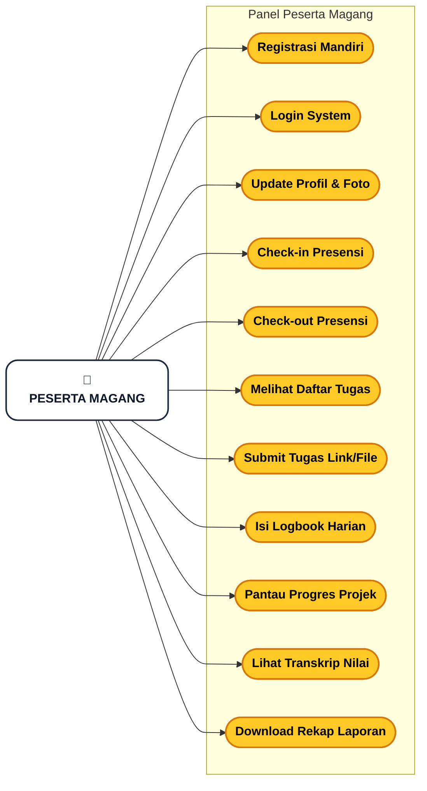
```mermaid
flowchart LR
    classDef actorStyle fill:#ffffff,stroke:#1e293b,stroke-width:2px,rx:15px,color:#0f172a;
    classDef ucStyle fill:#ffca28,stroke:#d97706,stroke-width:2px,color:#000000,font-weight:bold;

    Peserta["🧍<br/><b>PESERTA MAGANG</b>"]:::actorStyle

    subgraph PanelPeserta["Panel Peserta Magang"]
        direction TB
        UC_P1(["Registrasi Mandiri"]):::ucStyle
        UC_P2(["Login System"]):::ucStyle
        UC_P3(["Update Profil & Foto"]):::ucStyle
        UC_P4(["Check-in Presensi"]):::ucStyle
        UC_P5(["Check-out Presensi"]):::ucStyle
        UC_P6(["Melihat Daftar Tugas"]):::ucStyle
        UC_P7(["Submit Tugas Link/File"]):::ucStyle
        UC_P8(["Isi Logbook Harian"]):::ucStyle
        UC_P9(["Pantau Progres Projek"]):::ucStyle
        UC_P10(["Lihat Transkrip Nilai"]):::ucStyle
        UC_P11(["Download Rekap Laporan"]):::ucStyle
    end

    Peserta --> UC_P1
    Peserta --> UC_P2
    Peserta --> UC_P3
    Peserta --> UC_P4
    Peserta --> UC_P5
    Peserta --> UC_P6
    Peserta --> UC_P7
    Peserta --> UC_P8
    Peserta --> UC_P9
    Peserta --> UC_P10
    Peserta --> UC_P11
```

**Penjelasan Alur Use Case Peserta:**
1. **Registrasi & Login**: Peserta melakukan registrasi akun mandiri (`UC_P1`), kemudian dapat login (`UC_P2`) setelah disetujui oleh Admin.
2. **Presensi**: Peserta melakukan *Check-in* (`UC_P4`) saat datang dan *Check-out* (`UC_P5`) saat selesai magang harian.
3. **Pengerjakan Tugas & Logbook**: Peserta melihat daftar tugas (`UC_P6`), mengirimkan submisi link/file (`UC_P7`), dan mendokumentasikan jurnal kegiatan harian (`UC_P8`).
4. **Evaluasi & Laporan**: Peserta mengelola detail projek magang (`UC_P9`), melihat transkrip penilaian evaluasi akhir (`UC_P10`), dan mencetak rekap laporan (`UC_P11`).

---

### 3.3 Use Case Diagram - Panel Mentor

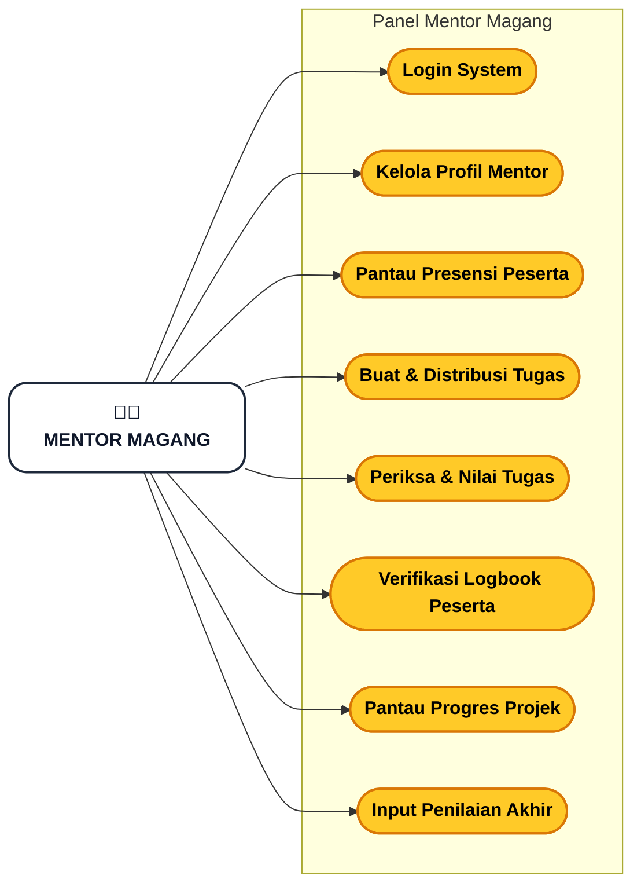
```mermaid
flowchart LR
    classDef actorStyle fill:#ffffff,stroke:#1e293b,stroke-width:2px,rx:15px,color:#0f172a;
    classDef ucStyle fill:#ffca28,stroke:#d97706,stroke-width:2px,color:#000000,font-weight:bold;

    subgraph PanelMentor["Panel Mentor Magang"]
        direction TB
        UC_M1(["Login System"]):::ucStyle
        UC_M2(["Kelola Profil Mentor"]):::ucStyle
        UC_M3(["Pantau Presensi Peserta"]):::ucStyle
        UC_M4(["Buat & Distribusi Tugas"]):::ucStyle
        UC_M5(["Periksa & Nilai Tugas"]):::ucStyle
        UC_M6(["Verifikasi Logbook Peserta"]):::ucStyle
        UC_M7(["Pantau Progres Projek"]):::ucStyle
        UC_M8(["Input Penilaian Akhir"]):::ucStyle
    end

    Mentor["👨‍🏫<br/><b>MENTOR MAGANG</b>"]:::actorStyle

    Mentor --> UC_M1
    Mentor --> UC_M2
    Mentor --> UC_M3
    Mentor --> UC_M4
    Mentor --> UC_M5
    Mentor --> UC_M6
    Mentor --> UC_M7
    Mentor --> UC_M8
```

**Penjelasan Alur Use Case Mentor:**
1. **Login & Bimbingan**: Mentor login (`UC_M1`) untuk mengelola seluruh peserta magang yang berada di bawah bimbingannya.
2. **Monitoring Presensi & Logbook**: Mentor memantau presensi harian (`UC_M3`) serta memeriksa dan memverifikasi logbook harian (`UC_M6`).
3. **Manajemen Tugas & Penilaian**: Mentor membagikan tugas baru (`UC_M4`), mengevaluasi submisi tugas (`UC_M5`), dan menginput borang evaluasi akhir (`UC_M8`).

---

### 3.4 Use Case Diagram - Panel Admin

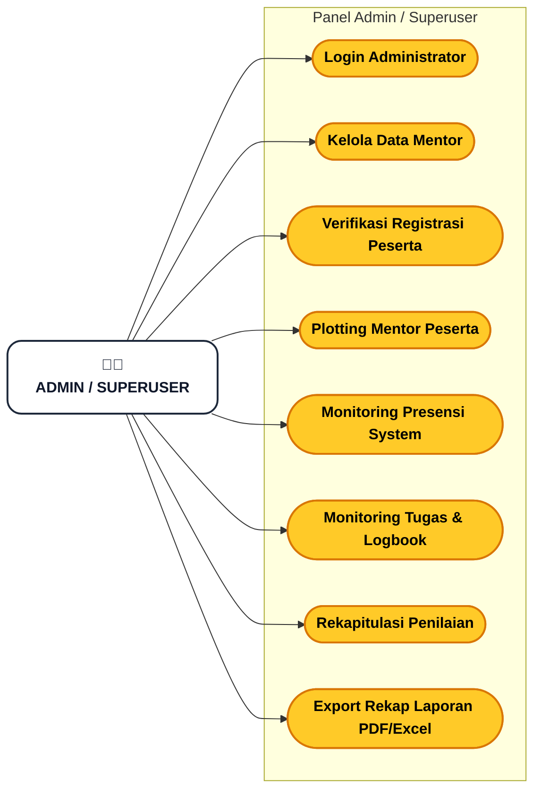
```mermaid
flowchart LR
    classDef actorStyle fill:#ffffff,stroke:#1e293b,stroke-width:2px,rx:15px,color:#0f172a;
    classDef ucStyle fill:#ffca28,stroke:#d97706,stroke-width:2px,color:#000000,font-weight:bold;

    subgraph PanelAdmin["Panel Admin / Superuser"]
        direction TB
        UC_A1(["Login Administrator"]):::ucStyle
        UC_A2(["Kelola Data Mentor"]):::ucStyle
        UC_A3(["Verifikasi Registrasi Peserta"]):::ucStyle
        UC_A4(["Plotting Mentor Peserta"]):::ucStyle
        UC_A5(["Monitoring Presensi System"]):::ucStyle
        UC_A6(["Monitoring Tugas & Logbook"]):::ucStyle
        UC_A7(["Rekapitulasi Penilaian"]):::ucStyle
        UC_A8(["Export Rekap Laporan PDF/Excel"]):::ucStyle
    end

    Admin["👨‍💼<br/><b>ADMIN / SUPERUSER</b>"]:::actorStyle

    Admin --> UC_A1
    Admin --> UC_A2
    Admin --> UC_A3
    Admin --> UC_A4
    Admin --> UC_A5
    Admin --> UC_A6
    Admin --> UC_A7
    Admin --> UC_A8
```

**Penjelasan Alur Use Case Admin:**
1. **Verifikasi & Plotting**: Admin melakukan verifikasi registrasi peserta baru (`UC_A3`) dan menentukan mentor pembimbing (`UC_A4`).
2. **Kelola Data Mentor**: Admin membuat dan mengelola data master mentor (`UC_A2`).
3. **Pengawasan & Laporan**: Admin memantau seluruh presensi (`UC_A5`), tugas & logbook (`UC_A6`), rekap nilai (`UC_A7`), serta mengunduh laporan PDF/Excel (`UC_A8`).

---

## 4. CLASS DIAGRAM

### 4.1 Overall Domain Model Class Diagram

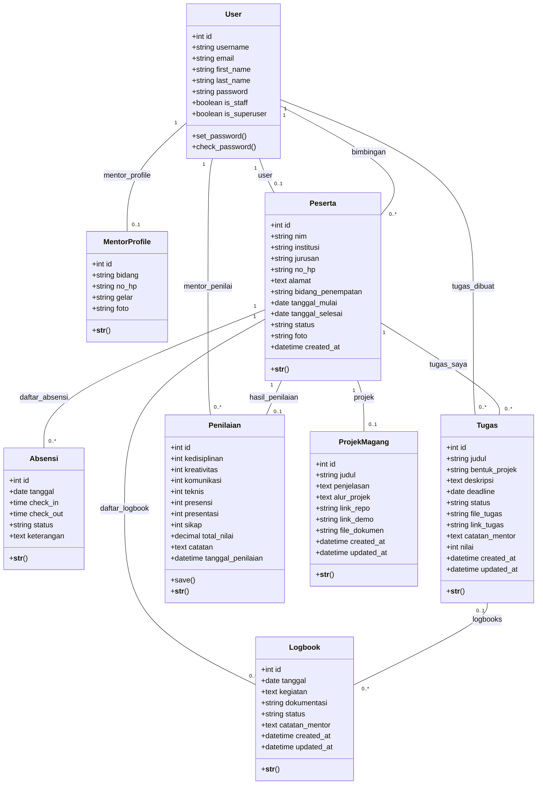
```mermaid
classDiagram
    class User {
        +int id
        +string username
        +string email
        +string first_name
        +string last_name
        +string password
        +boolean is_staff
        +boolean is_superuser
        +set_password()
        +check_password()
    }

    class MentorProfile {
        +int id
        +string bidang
        +string no_hp
        +string gelar
        +string foto
        +__str__()
    }

    class Peserta {
        +int id
        +string nim
        +string institusi
        +string jurusan
        +string no_hp
        +text alamat
        +string bidang_penempatan
        +date tanggal_mulai
        +date tanggal_selesai
        +string status
        +string foto
        +datetime created_at
        +__str__()
    }

    class Absensi {
        +int id
        +date tanggal
        +time check_in
        +time check_out
        +string status
        +text keterangan
        +__str__()
    }

    class Tugas {
        +int id
        +string judul
        +string bentuk_projek
        +text deskripsi
        +date deadline
        +string status
        +string file_tugas
        +string link_tugas
        +text catatan_mentor
        +int nilai
        +datetime created_at
        +datetime updated_at
        +__str__()
    }

    class Logbook {
        +int id
        +date tanggal
        +text kegiatan
        +string dokumentasi
        +string status
        +text catatan_mentor
        +datetime created_at
        +datetime updated_at
        +__str__()
    }

    class Penilaian {
        +int id
        +int kedisiplinan
        +int kreativitas
        +int komunikasi
        +int teknis
        +int presensi
        +int presentasi
        +int sikap
        +decimal total_nilai
        +text catatan
        +datetime tanggal_penilaian
        +save()
        +__str__()
    }

    class ProjekMagang {
        +int id
        +string judul
        +text penjelasan
        +text alur_projek
        +string link_repo
        +string link_demo
        +string file_dokumen
        +datetime created_at
        +datetime updated_at
        +__str__()
    }

    User "1" -- "0..1" MentorProfile : mentor_profile
    User "1" -- "0..1" Peserta : user
    User "1" -- "0..*" Peserta : bimbingan
    User "1" -- "0..*" Tugas : tugas_dibuat
    User "1" -- "0..*" Penilaian : mentor_penilai

    Peserta "1" -- "0..*" Absensi : daftar_absensi
    Peserta "1" -- "0..*" Tugas : tugas_saya
    Peserta "1" -- "0..*" Logbook : daftar_logbook
    Peserta "1" -- "0..1" Penilaian : hasil_penilaian
    Peserta "1" -- "0..1" ProjekMagang : projek

    Tugas "0..1" -- "0..*" Logbook : logbooks
```

---

### 4.2 Class Diagram - Panel Peserta

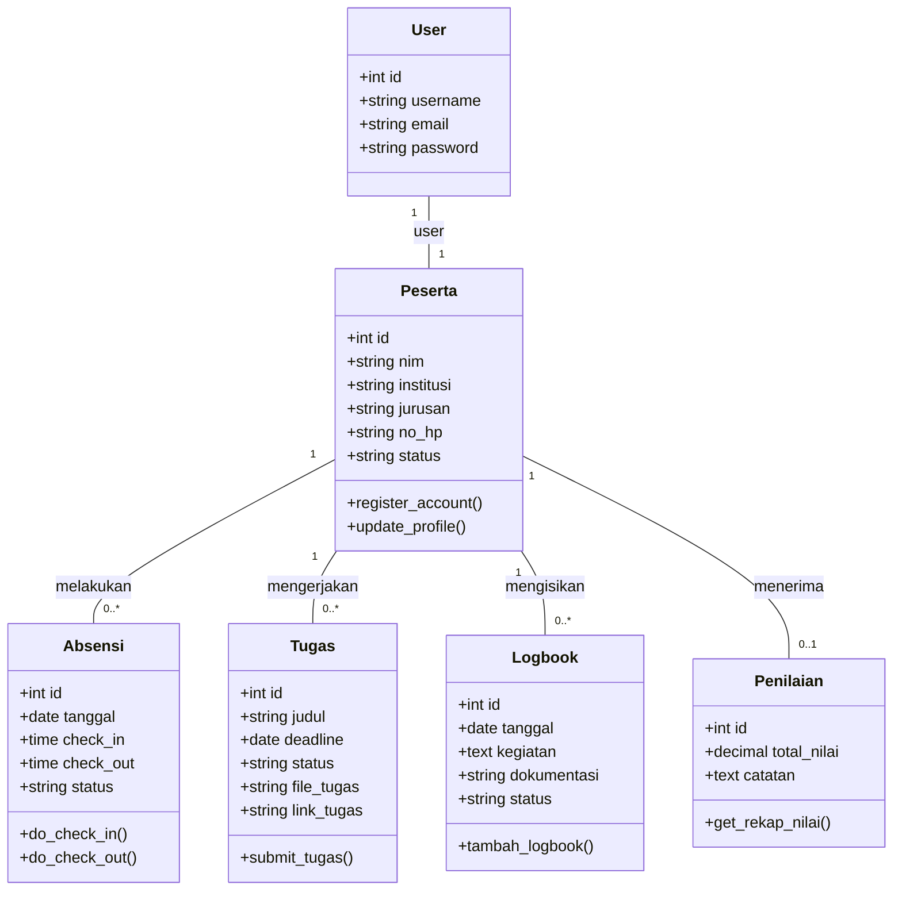
```mermaid
classDiagram
    class User {
        +int id
        +string username
        +string email
        +string password
    }

    class Peserta {
        +int id
        +string nim
        +string institusi
        +string jurusan
        +string no_hp
        +string status
        +register_account()
        +update_profile()
    }

    class Absensi {
        +int id
        +date tanggal
        +time check_in
        +time check_out
        +string status
        +do_check_in()
        +do_check_out()
    }

    class Tugas {
        +int id
        +string judul
        +date deadline
        +string status
        +string file_tugas
        +string link_tugas
        +submit_tugas()
    }

    class Logbook {
        +int id
        +date tanggal
        +text kegiatan
        +string dokumentasi
        +string status
        +tambah_logbook()
    }

    class Penilaian {
        +int id
        +decimal total_nilai
        +text catatan
        +get_rekap_nilai()
    }

    User "1" -- "1" Peserta : user
    Peserta "1" -- "0..*" Absensi : melakukan
    Peserta "1" -- "0..*" Tugas : mengerjakan
    Peserta "1" -- "0..*" Logbook : mengisikan
    Peserta "1" -- "0..1" Penilaian : menerima
```

---

### 4.3 Class Diagram - Panel Mentor

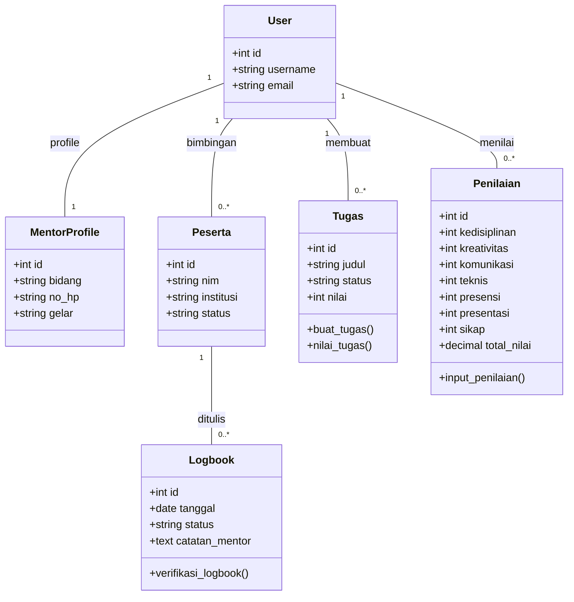
```mermaid
classDiagram
    class User {
        +int id
        +string username
        +string email
    }

    class MentorProfile {
        +int id
        +string bidang
        +string no_hp
        +string gelar
    }

    class Peserta {
        +int id
        +string nim
        +string institusi
        +string status
    }

    class Tugas {
        +int id
        +string judul
        +string status
        +int nilai
        +buat_tugas()
        +nilai_tugas()
    }

    class Logbook {
        +int id
        +date tanggal
        +string status
        +text catatan_mentor
        +verifikasi_logbook()
    }

    class Penilaian {
        +int id
        +int kedisiplinan
        +int kreativitas
        +int komunikasi
        +int teknis
        +int presensi
        +int presentasi
        +int sikap
        +decimal total_nilai
        +input_penilaian()
    }

    User "1" -- "1" MentorProfile : profile
    User "1" -- "0..*" Peserta : bimbingan
    User "1" -- "0..*" Tugas : membuat
    Peserta "1" -- "0..*" Logbook : ditulis
    User "1" -- "0..*" Penilaian : menilai
```

---

### 4.4 Class Diagram - Panel Admin

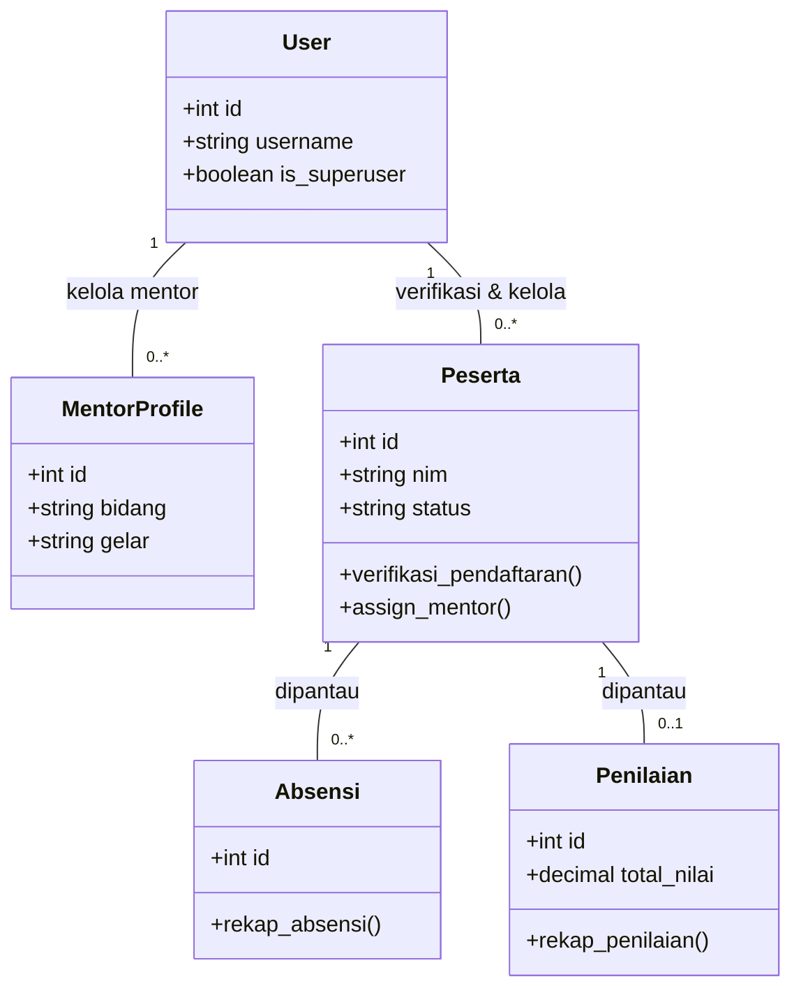
```mermaid
classDiagram
    class User {
        +int id
        +string username
        +boolean is_superuser
    }

    class MentorProfile {
        +int id
        +string bidang
        +string gelar
    }

    class Peserta {
        +int id
        +string nim
        +string status
        +verifikasi_pendaftaran()
        +assign_mentor()
    }

    class Absensi {
        +int id
        +rekap_absensi()
    }

    class Penilaian {
        +int id
        +decimal total_nilai
        +rekap_penilaian()
    }

    User "1" -- "0..*" Peserta : verifikasi & kelola
    User "1" -- "0..*" MentorProfile : kelola mentor
    Peserta "1" -- "0..*" Absensi : dipantau
    Peserta "1" -- "0..1" Penilaian : dipantau
```

---

## 5. SEQUENCE DIAGRAM

### 5.1 Sequence Diagram - Panel Peserta

#### 5.1.1 Alur Registrasi Peserta
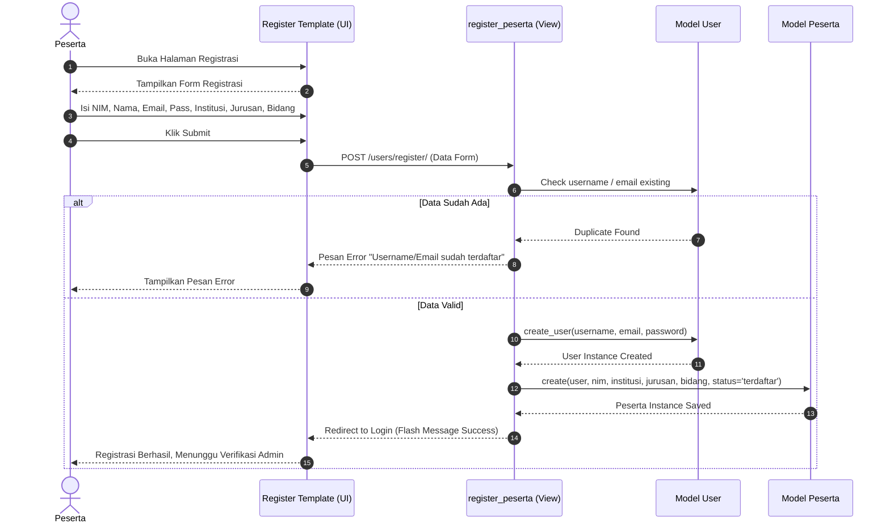
```mermaid
sequenceDiagram
    autonumber
    actor Peserta
    participant Form as Register Template (UI)
    participant View as register_peserta (View)
    participant UserDB as Model User
    participant PesertaDB as Model Peserta

    Peserta->>Form: Buka Halaman Registrasi
    Form-->>Peserta: Tampilkan Form Registrasi
    Peserta->>Form: Isi NIM, Nama, Email, Pass, Institusi, Jurusan, Bidang
    Peserta->>Form: Klik Submit
    Form->>View: POST /users/register/ (Data Form)
    View->>UserDB: Check username / email existing
    alt Data Sudah Ada
        UserDB-->>View: Duplicate Found
        View-->>Form: Pesan Error "Username/Email sudah terdaftar"
        Form-->>Peserta: Tampilkan Pesan Error
    else Data Valid
        View->>UserDB: create_user(username, email, password)
        UserDB-->>View: User Instance Created
        View->>PesertaDB: create(user, nim, institusi, jurusan, bidang, status='terdaftar')
        PesertaDB-->>View: Peserta Instance Saved
        View-->>Form: Redirect to Login (Flash Message Success)
        Form-->>Peserta: Registrasi Berhasil, Menunggu Verifikasi Admin
    end
```

---

#### 5.1.2 Alur Login Peserta
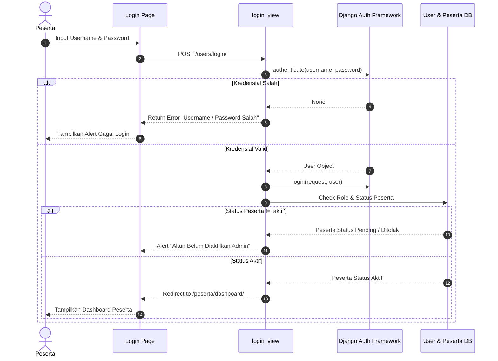
```mermaid
sequenceDiagram
    autonumber
    actor Peserta
    participant UI as Login Page
    participant View as login_view
    participant Auth as Django Auth Framework
    participant DB as User & Peserta DB

    Peserta->>UI: Input Username & Password
    UI->>View: POST /users/login/
    View->>Auth: authenticate(username, password)
    alt Kredensial Salah
        Auth-->>View: None
        View-->>UI: Return Error "Username / Password Salah"
        UI-->>Peserta: Tampilkan Alert Gagal Login
    else Kredensial Valid
        Auth-->>View: User Object
        View->>Auth: login(request, user)
        View->>DB: Check Role & Status Peserta
        alt Status Peserta != 'aktif'
            DB-->>View: Peserta Status Pending / Ditolak
            View-->>UI: Alert "Akun Belum Diaktifkan Admin"
        else Status Aktif
            DB-->>View: Peserta Status Aktif
            View-->>UI: Redirect to /peserta/dashboard/
            UI-->>Peserta: Tampilkan Dashboard Peserta
        end
    end
```

---

#### 5.1.3 Alur Absensi (Check-in & Check-out)
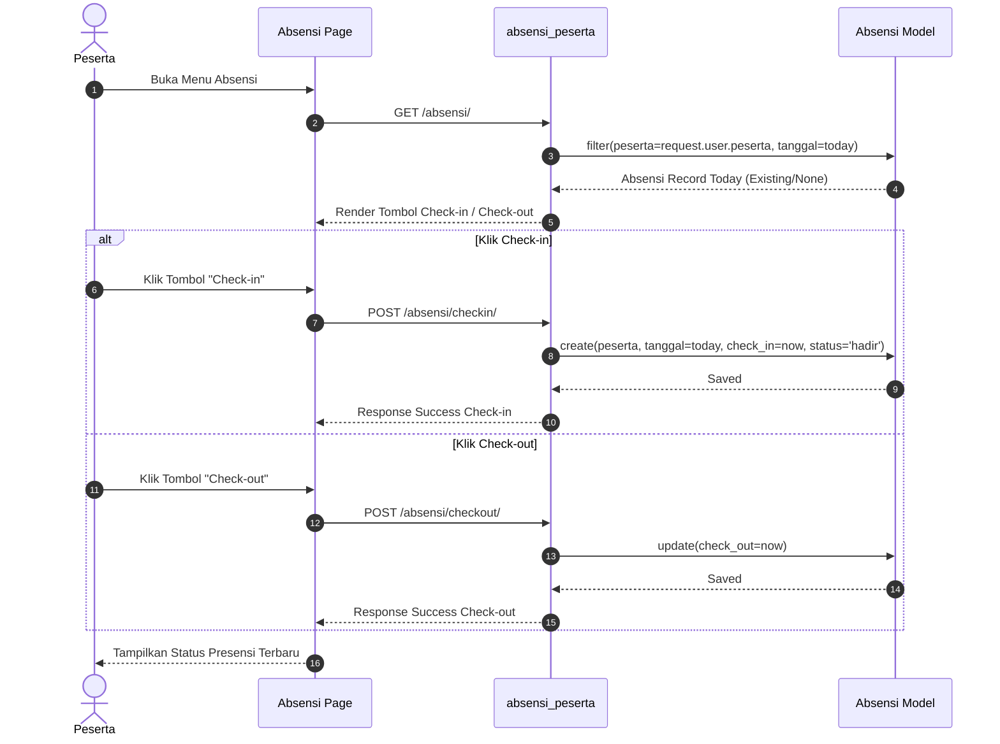
```mermaid
sequenceDiagram
    autonumber
    actor Peserta
    participant UI as Absensi Page
    participant View as absensi_peserta
    participant DB as Absensi Model

    Peserta->>UI: Buka Menu Absensi
    UI->>View: GET /absensi/
    View->>DB: filter(peserta=request.user.peserta, tanggal=today)
    DB-->>View: Absensi Record Today (Existing/None)
    View-->>UI: Render Tombol Check-in / Check-out

    alt Klik Check-in
        Peserta->>UI: Klik Tombol "Check-in"
        UI->>View: POST /absensi/checkin/
        View->>DB: create(peserta, tanggal=today, check_in=now, status='hadir')
        DB-->>View: Saved
        View-->>UI: Response Success Check-in
    else Klik Check-out
        Peserta->>UI: Klik Tombol "Check-out"
        UI->>View: POST /absensi/checkout/
        View->>DB: update(check_out=now)
        DB-->>View: Saved
        View-->>UI: Response Success Check-out
    end
    UI-->>Peserta: Tampilkan Status Presensi Terbaru
```

---

#### 5.1.4 Alur Submit Tugas
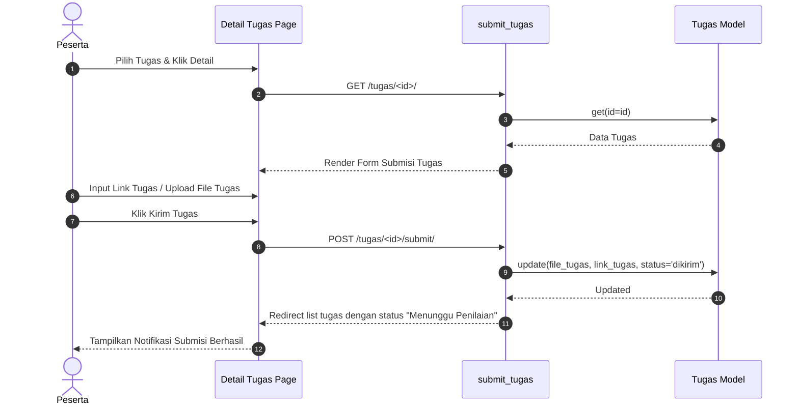
```mermaid
sequenceDiagram
    autonumber
    actor Peserta
    participant UI as Detail Tugas Page
    participant View as submit_tugas
    participant DB as Tugas Model

    Peserta->>UI: Pilih Tugas & Klik Detail
    UI->>View: GET /tugas/<id>/
    View->>DB: get(id=id)
    DB-->>View: Data Tugas
    View-->>UI: Render Form Submisi Tugas

    Peserta->>UI: Input Link Tugas / Upload File Tugas
    Peserta->>UI: Klik Kirim Tugas
    UI->>View: POST /tugas/<id>/submit/
    View->>DB: update(file_tugas, link_tugas, status='dikirim')
    DB-->>View: Updated
    View-->>UI: Redirect list tugas dengan status "Menunggu Penilaian"
    UI-->>Peserta: Tampilkan Notifikasi Submisi Berhasil
```

---

#### 5.1.5 Alur Pengisian Logbook
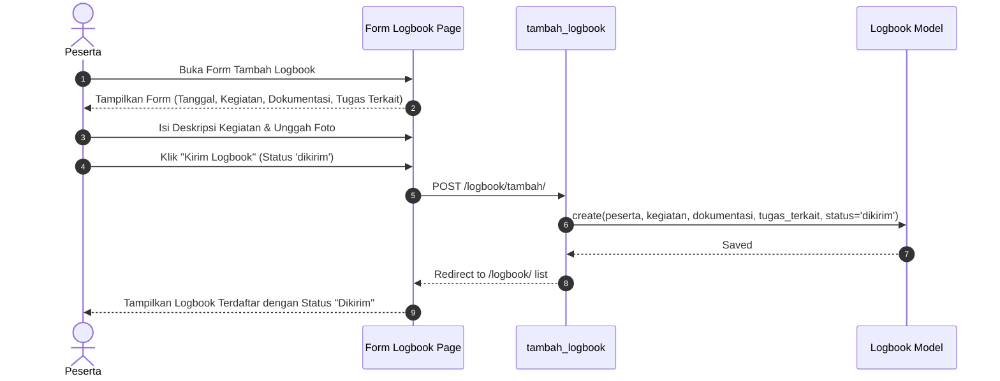
```mermaid
sequenceDiagram
    autonumber
    actor Peserta
    participant UI as Form Logbook Page
    participant View as tambah_logbook
    participant DB as Logbook Model

    Peserta->>UI: Buka Form Tambah Logbook
    UI-->>Peserta: Tampilkan Form (Tanggal, Kegiatan, Dokumentasi, Tugas Terkait)
    Peserta->>UI: Isi Deskripsi Kegiatan & Unggah Foto
    Peserta->>UI: Klik "Kirim Logbook" (Status 'dikirim')
    UI->>View: POST /logbook/tambah/
    View->>DB: create(peserta, kegiatan, dokumentasi, tugas_terkait, status='dikirim')
    DB-->>View: Saved
    View-->>UI: Redirect to /logbook/ list
    UI-->>Peserta: Tampilkan Logbook Terdaftar dengan Status "Dikirim"
```

---

#### 5.1.6 Alur Melihat Penilaian
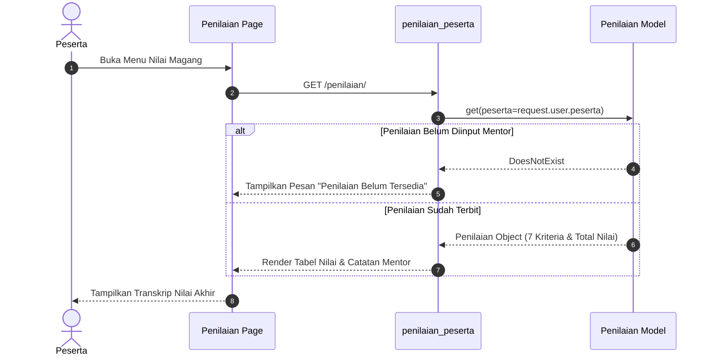
```mermaid
sequenceDiagram
    autonumber
    actor Peserta
    participant UI as Penilaian Page
    participant View as penilaian_peserta
    participant DB as Penilaian Model

    Peserta->>UI: Buka Menu Nilai Magang
    UI->>View: GET /penilaian/
    View->>DB: get(peserta=request.user.peserta)
    alt Penilaian Belum Diinput Mentor
        DB-->>View: DoesNotExist
        View-->>UI: Tampilkan Pesan "Penilaian Belum Tersedia"
    else Penilaian Sudah Terbit
        DB-->>View: Penilaian Object (7 Kriteria & Total Nilai)
        View-->>UI: Render Tabel Nilai & Catatan Mentor
    end
    UI-->>Peserta: Tampilkan Transkrip Nilai Akhir
```

---

### 5.2 Sequence Diagram - Panel Mentor

#### 5.2.1 Alur Login Mentor
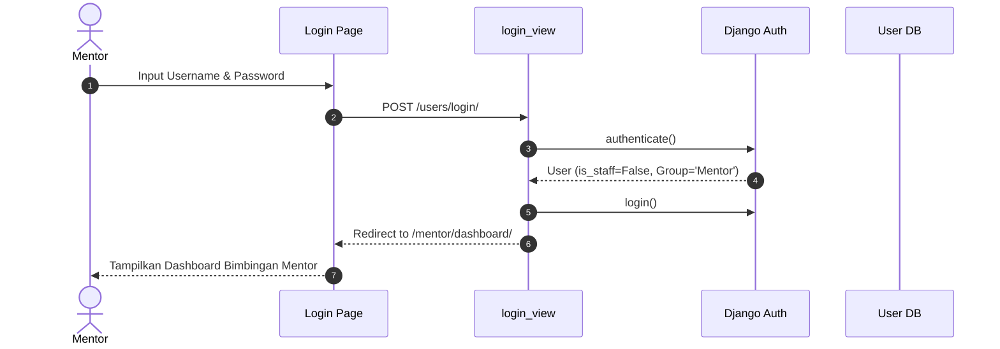
```mermaid
sequenceDiagram
    autonumber
    actor Mentor
    participant UI as Login Page
    participant View as login_view
    participant Auth as Django Auth
    participant DB as User DB

    Mentor->>UI: Input Username & Password
    UI->>View: POST /users/login/
    View->>Auth: authenticate()
    Auth-->>View: User (is_staff=False, Group='Mentor')
    View->>Auth: login()
    View-->>UI: Redirect to /mentor/dashboard/
    UI-->>Mentor: Tampilkan Dashboard Bimbingan Mentor
```

---

#### 5.2.2 Alur Monitor Absensi Bimbingan
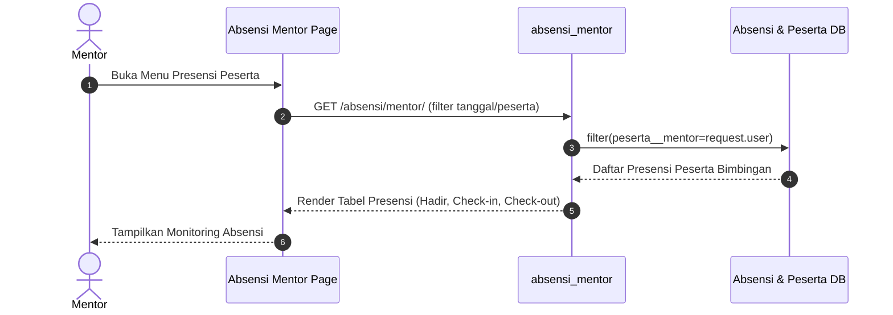
```mermaid
sequenceDiagram
    autonumber
    actor Mentor
    participant UI as Absensi Mentor Page
    participant View as absensi_mentor
    participant DB as Absensi & Peserta DB

    Mentor->>UI: Buka Menu Presensi Peserta
    UI->>View: GET /absensi/mentor/ (filter tanggal/peserta)
    View->>DB: filter(peserta__mentor=request.user)
    DB-->>View: Daftar Presensi Peserta Bimbingan
    View-->>UI: Render Tabel Presensi (Hadir, Check-in, Check-out)
    UI-->>Mentor: Tampilkan Monitoring Absensi
```

---

#### 5.2.3 Alur Pembuatan & Penilaian Tugas
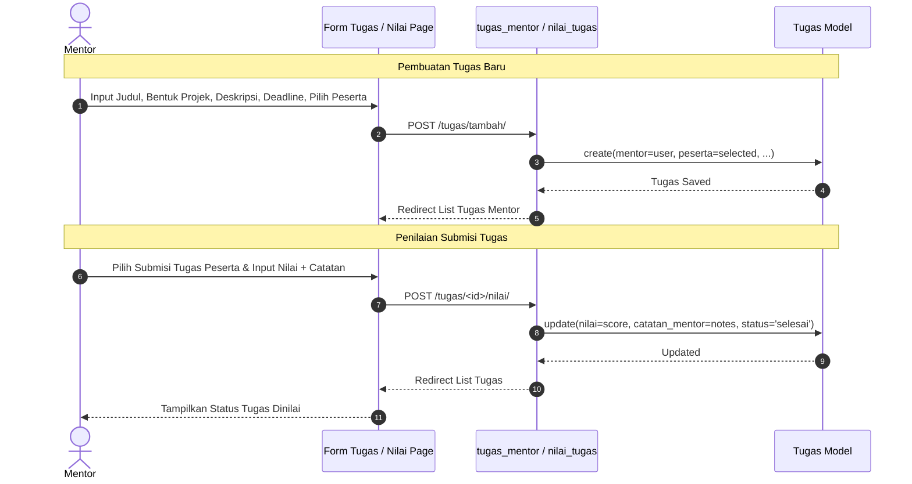
```mermaid
sequenceDiagram
    autonumber
    actor Mentor
    participant UI as Form Tugas / Nilai Page
    participant View as tugas_mentor / nilai_tugas
    participant DB as Tugas Model

    Note over Mentor, DB: Pembuatan Tugas Baru
    Mentor->>UI: Input Judul, Bentuk Projek, Deskripsi, Deadline, Pilih Peserta
    UI->>View: POST /tugas/tambah/
    View->>DB: create(mentor=user, peserta=selected, ...)
    DB-->>View: Tugas Saved
    View-->>UI: Redirect List Tugas Mentor

    Note over Mentor, DB: Penilaian Submisi Tugas
    Mentor->>UI: Pilih Submisi Tugas Peserta & Input Nilai + Catatan
    UI->>View: POST /tugas/<id>/nilai/
    View->>DB: update(nilai=score, catatan_mentor=notes, status='selesai')
    DB-->>View: Updated
    View-->>UI: Redirect List Tugas
    UI-->>Mentor: Tampilkan Status Tugas Dinilai
```

---

#### 5.2.4 Alur Verifikasi Logbook Peserta
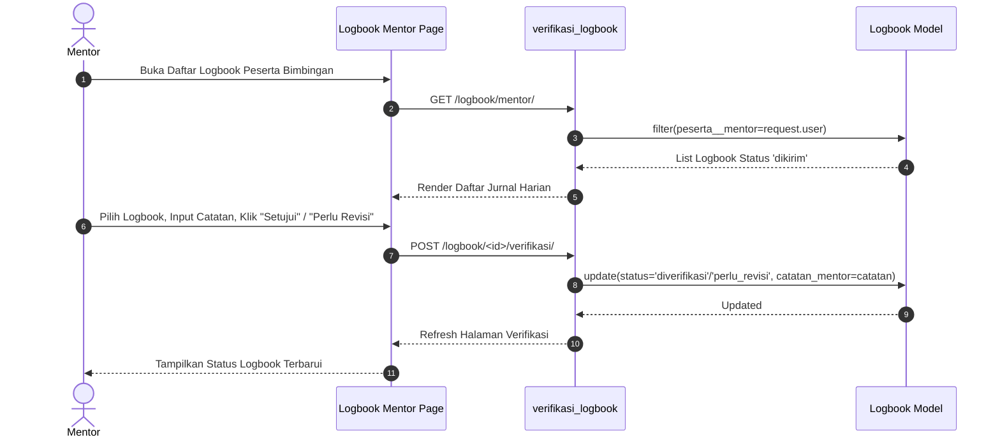
```mermaid
sequenceDiagram
    autonumber
    actor Mentor
    participant UI as Logbook Mentor Page
    participant View as verifikasi_logbook
    participant DB as Logbook Model

    Mentor->>UI: Buka Daftar Logbook Peserta Bimbingan
    UI->>View: GET /logbook/mentor/
    View->>DB: filter(peserta__mentor=request.user)
    DB-->>View: List Logbook Status 'dikirim'
    View-->>UI: Render Daftar Jurnal Harian

    Mentor->>UI: Pilih Logbook, Input Catatan, Klik "Setujui" / "Perlu Revisi"
    UI->>View: POST /logbook/<id>/verifikasi/
    View->>DB: update(status='diverifikasi'/'perlu_revisi', catatan_mentor=catatan)
    DB-->>View: Updated
    View-->>UI: Refresh Halaman Verifikasi
    UI-->>Mentor: Tampilkan Status Logbook Terbarui
```

---

#### 5.2.5 Alur Input Penilaian Akhir
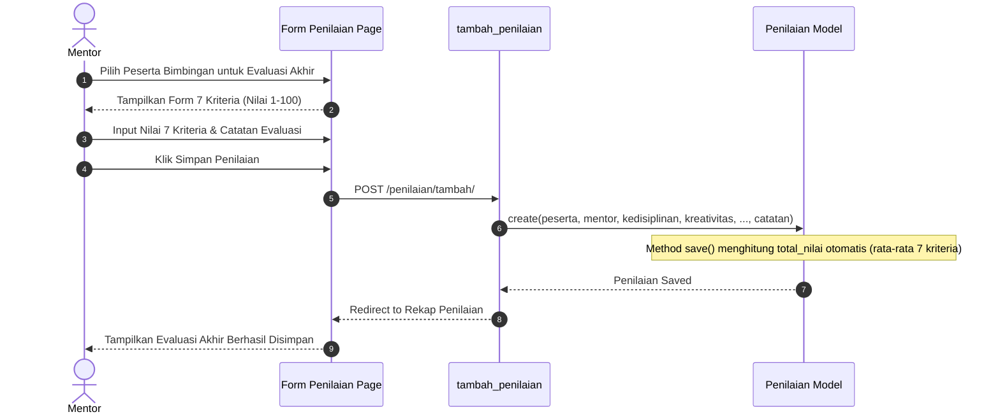
```mermaid
sequenceDiagram
    autonumber
    actor Mentor
    participant UI as Form Penilaian Page
    participant View as tambah_penilaian
    participant DB as Penilaian Model

    Mentor->>UI: Pilih Peserta Bimbingan untuk Evaluasi Akhir
    UI-->>Mentor: Tampilkan Form 7 Kriteria (Nilai 1-100)
    Mentor->>UI: Input Nilai 7 Kriteria & Catatan Evaluasi
    Mentor->>UI: Klik Simpan Penilaian
    UI->>View: POST /penilaian/tambah/
    View->>DB: create(peserta, mentor, kedisiplinan, kreativitas, ..., catatan)
    Note over DB: Method save() menghitung total_nilai otomatis (rata-rata 7 kriteria)
    DB-->>View: Penilaian Saved
    View-->>UI: Redirect to Rekap Penilaian
    UI-->>Mentor: Tampilkan Evaluasi Akhir Berhasil Disimpan
```

---

### 5.3 Sequence Diagram - Panel Admin

#### 5.3.1 Alur Verifikasi Pendaftaran & Manajemen Peserta
```mermaid
sequenceDiagram
    autonumber
    actor Admin
    participant UI as Panel Kelola Peserta
    participant View as terima_peserta / assign_mentor
    participant DB as Peserta & User DB

    Admin->>UI: Buka Daftar Peserta (Status 'terdaftar')
    UI->>View: GET /peserta/kelola/
    View->>DB: filter(status='terdaftar')
    DB-->>View: List Peserta Baru
    View-->>UI: Render Tabel Verifikasi

    Admin->>UI: Pilih Peserta, Tentukan Mentor & Klik "Setujui"
    UI->>View: POST /peserta/<id>/terima/ (mentor_id)
    View->>DB: update(status='aktif', mentor=mentor_user)
    DB-->>View: Updated
    View-->>UI: Refresh Data Peserta
    UI-->>Admin: Peserta Berhasil Diaktifkan & Terhubung ke Mentor
```

---

#### 5.3.2 Alur Manajemen Mentor (CRUD Mentor)
```mermaid
sequenceDiagram
    autonumber
    actor Admin
    participant UI as Panel Kelola Mentor
    participant View as tambah_mentor
    participant DB as User & MentorProfile DB

    Admin->>UI: Input Form Mentor (Nama, Email, Pass, Bidang, Gelar, No HP)
    UI->>View: POST /users/mentor/tambah/
    View->>DB: create_user(username, email, password)
    DB-->>View: User Created
    View->>DB: create(user=new_user, bidang, gelar, no_hp)
    DB-->>View: MentorProfile Created
    View-->>UI: Redirect List Mentor
    UI-->>Admin: Tampilkan Mentor Baru dalam Data Sistem
```

---

#### 5.3.3 Alur Monitoring & Rekap (Absensi, Tugas, Logbook, Penilaian)
```mermaid
sequenceDiagram
    autonumber
    actor Admin
    participant UI as Panel Rekap Admin
    participant View as rekap_view (Absensi/Penilaian)
    participant DB as System Database

    Admin->>UI: Buka Menu Rekap (Absensi / Penilaian / Laporan)
    UI->>View: GET /admin/rekap/?filter_bidang=Aptika
    View->>DB: Aggregate & Join All Models (Peserta, Absensi, Penilaian, Logbook)
    DB-->>View: Data Summary & Statistics
    View-->>UI: Render Tabel Rekapitulasi & Grafik
    Admin->>UI: Klik Export Rekap (PDF / Excel)
    UI->>View: GET /admin/rekap/export/
    View-->>UI: Download File Rekapitulasi
    UI-->>Admin: File Rekap Disimpan
```

---

## 6. STATE DIAGRAM

Diagram ini mengontrol alur siklus hidup (*lifecycle state*) dari entitas utama pada sistem.

### 6.1 State Diagram - Lifecycle Status Peserta Magang
```mermaid
stateDiagram-v2
    [*] --> Terdaftar : Registrasi Mandiri Peserta
    Terdaftar --> Aktif : Disetujui Admin & Di-plotting Mentor
    Terdaftar --> Ditolak : Ditolak Admin (Berkas Tidak Sesuai)
    Ditolak --> [*] : Akses Terkunci
    Aktif --> Selesai : Masa Magang Berakhir & Nilai Diterbitkan
    Selesai --> [*] : Download Laporan Akhir
```

---

### 6.2 State Diagram - Lifecycle Status Tugas Magang
```mermaid
stateDiagram-v2
    [*] --> Belum : Mentor Buat Tugas Baru
    Belum --> Proses : Peserta Klik 'Kerjakan Tugas'
    Proses --> Dikirim : Peserta Submit Link / File Tugas
    Dikirim --> PerluRevisi : Mentor Periksa & Minta Revisi
    PerluRevisi --> Proses : Peserta Perbaiki Tugas
    Dikirim --> Selesai : Mentor Memberikan Nilai Akhir
    Selesai --> [*]
```

---

### 6.3 State Diagram - Lifecycle Status Logbook Harian
```mermaid
stateDiagram-v2
    [*] --> Draft : Peserta Buat Logbook (Draft)
    Draft --> Dikirim : Peserta Kirim Logbook ke Mentor
    Dikirim --> Diverifikasi : Mentor Menyetujui Logbook
    Dikirim --> PerluRevisi : Mentor Meminta Revisi Jurnal
    PerluRevisi --> Draft : Peserta Perbaiki Isi Logbook
    Diverifikasi --> [*]
```

---

## 7. FLOWCHART SISTEM & ACTIVITY DIAGRAMS

### 7.1 Master System Flowchart (End-to-End Workflow)
Flowchart ini memetakan alur utama seluruh proses bisnis Sistem Manajemen Magang dari tahap pendaftaran hingga kelulusan/rekap laporan.

```mermaid
flowchart TD
    Start([Mulai]) --> Reg[/Registrasi Akun Peserta/]
    Reg --> VerifAdmin{Diverifikasi Admin?}
    VerifAdmin -- Ditolak --> Reject[Status: Ditolak] --> EndReject([Akses Ditolak])
    VerifAdmin -- Disetujui --> Approve[Status: Aktif & Plotting Mentor]
    Approve --> Login[/Login Ke Sistem/]

    Login --> ActivityChoice{Aktivitas Harian}
    
    %% Branch Absensi
    ActivityChoice -- Presensi Harian --> AbsenCheck{Check-in / Check-out}
    AbsenCheck --> CatatAbsen[Catat Waktu & Status Presensi] --> LoopActivity[Kembali ke Menu Utama]

    %% Branch Tugas
    ActivityChoice -- Kelola Tugas --> TaskFlow[Lihat / Kerjakan / Submit Tugas]
    TaskFlow --> MentorReviewTask{Review Mentor}
    MentorReviewTask -- Perlu Revisi --> TaskFlow
    MentorReviewTask -- Selesai & Dinilai --> SaveTaskScore[Simpan Skor Tugas] --> LoopActivity

    %% Branch Logbook
    ActivityChoice -- Isi Logbook --> LogbookSubmit[Input Kegiatan & Foto Dokumentasi]
    LogbookSubmit --> MentorVerifLog{Verifikasi Mentor}
    MentorVerifLog -- Perlu Revisi --> LogbookSubmit
    MentorVerifLog -- Diverifikasi --> SaveLogbook[Status Logbook: Diverifikasi] --> LoopActivity

    LoopActivity --> CheckFinish{Masa Magang Selesai?}
    CheckFinish -- Belum --> ActivityChoice
    CheckFinish -- Ya --> EvalMentor[Mentor Input Penilaian Akhir 7 Kriteria]
    EvalMentor --> CalcTotal[Sistem Hitung Otomatis Total Nilai]
    CalcTotal --> ExportReport[Admin / Peserta Export Rekap Laporan PDF/Excel]
    ExportReport --> End([Selesai])
```

---

### 7.2 Activity Diagram - Panel Peserta

#### 7.2.1 Activity Diagram - Registrasi & Login Peserta
```mermaid
flowchart TD
    Start([Mulai]) --> A[/Buka Halaman Registrasi/]
    A --> B[Isi Data Diri: NIM, Nama, Email, Password, Institusi, Bidang]
    B --> C[Unggah Pas Foto Magang]
    C --> D{Form Valid?}
    D -- Tidak --> E[Tampilkan Pesan Error Validasi]
    E --> B
    D -- Ya --> F[Simpan Akun dengan Status 'Terdaftar']
    F --> G[Tampilkan Notifikasi 'Menunggu Verifikasi Admin']
    G --> H[/Buka Halaman Login/]
    H --> I[Input Username & Password]
    I --> J{Kredensial Valid?}
    J -- Tidak --> K[Tampilkan Error Login]
    K --> H
    J -- Ya --> L{Status Peserta?}
    L -- 'Terdaftar' / 'Ditolak' --> M[Tampilkan Pesan 'Akun Belum Diaktifkan Admin']
    M --> EndPending([Selesai - Akses Ditolak])
    L -- 'Aktif' --> N[Masuk ke Dashboard Peserta]
    N --> EndAktif([Selesai - Masuk Sistem])
```

---

#### 7.2.2 Activity Diagram - Presensi Harian (Absensi)
```mermaid
flowchart TD
    Start([Mulai]) --> A[Masuk Dashboard Peserta]
    A --> B[/Buka Menu Absensi/]
    B --> C{Sudah Check-in Hari Ini?}
    C -- Belum --> D[Tampilkan Tombol 'Check-in']
    D --> E[Klik Tombol 'Check-in']
    E --> F[Sistem Catat Jam Check-in & Status 'Hadir']
    F --> G[Tampilkan Status Presensi 'Hadir']
    C -- Sudah --> H{Sudah Check-out?}
    H -- Belum --> I[Tampilkan Tombol 'Check-out']
    I --> J[Klik Tombol 'Check-out']
    J --> K[Sistem Catat Jam Check-out]
    K --> G
    H -- Sudah --> L[Tampilkan Informasi Presensi Hari Ini Selesai]
    L --> End([Selesai])
    G --> End
```

---

#### 7.2.3 Activity Diagram - Pengerjaan & Submisi Tugas
```mermaid
flowchart TD
    Start([Mulai]) --> A[Buka Daftar Tugas Saya]
    A --> B[Pilih Tugas dengan Status 'Belum Dikerjakan' / 'Perlu Revisi']
    B --> C[Klik 'Mulai Kerjakan']
    C --> D[Status Tugas Berubah Menjadi 'Sedang Dikerjakan']
    D --> E[Kerjakan Tugas & Siapkan File / Link Repository Demo]
    E --> F[Buka Form Submisi Tugas]
    F --> G[Unggah File Tugas / Input Link Submisi]
    G --> H[Klik 'Kirim Tugas']
    H --> I[Sistem Update Status Tugas Menjadi 'Dikirim / Menunggu Penilaian']
    I --> End([Selesai])
```

---

#### 7.2.4 Activity Diagram - Pengisian Logbook Harian
```mermaid
flowchart TD
    Start([Mulai]) --> A[Buka Menu Logbook Harian]
    A --> B[Klik 'Tambah Logbook Baru']
    B --> C[Isi Rincian Kegiatan Harian]
    C --> D[Unggah Foto / File Dokumentasi]
    D --> E[Pilih Tugas/Projek Terkait (Opsional)]
    E --> F{Simpan Sebagai?}
    F -- Draft --> G[Simpan Status 'Draft']
    G --> EndDraft([Selesai - Dapat Diedit Kembali])
    F -- Kirim --> H[Simpan Status 'Dikirim']
    H --> EndKirim([Selesai - Menunggu Verifikasi Mentor])
```

---

#### 7.2.5 Activity Diagram - Melihat Penilaian
```mermaid
flowchart TD
    Start([Mulai]) --> A[Buka Menu Penilaian Magang]
    A --> B{Nilai Sudah Diinput Mentor?}
    B -- Belum --> C[Tampilkan Pesan 'Evaluasi Akhir Belum Tersedia']
    C --> EndBelum([Selesai])
    B -- Sudah --> D[Tampilkan Rincian 7 Kriteria Nilai]
    D --> E[Tampilkan Nilai Akhir & Catatan Evaluasi Mentor]
    E --> EndSudah([Selesai])
```

---

### 7.3 Activity Diagram - Panel Mentor

#### 7.3.1 Activity Diagram - Login & Monitoring Presensi Bimbingan
```mermaid
flowchart TD
    Start([Mulai]) --> A[/Buka Halaman Login/]
    A --> B[Input Username & Password Mentor]
    B --> C{Otentikasi Valid?}
    C -- Tidak --> D[Tampilkan Pesan Error Login]
    D --> A
    C -- Ya --> E[Masuk Dashboard Mentor]
    E --> F[/Buka Menu Absensi Bimbingan/]
    F --> G[Pilih Filter Tanggal / Peserta Magang]
    G --> H[Tampilkan Rekapitulasi Presensi Peserta]
    H --> End([Selesai])
```

---

#### 7.3.2 Activity Diagram - Manajemen & Penilaian Tugas
```mermaid
flowchart TD
    Start([Mulai]) --> A[Buka Menu Manajemen Tugas Mentor]
    A --> B{Pilih Aksi}
    B -- Buat Tugas Baru --> C[Isi Judul, Deskripsi, Deadline & Target Peserta]
    C --> D[Klik 'Kirim Tugas']
    D --> E[Sistem Distribusikan Tugas ke Peserta]
    E --> EndTugas([Selesai])

    B -- Evaluasi Submisi Peserta --> F[Pilih Submisi Tugas Peserta]
    F --> G[Periksa File / Link Hasil Pengerjaan]
    G --> H{Hasil Pengerjaan?}
    H -- Sesuai --> I[Input Nilai & Catatan Apresiasi]
    I --> J[Set Status Tugas 'Selesai']
    J --> EndNilai([Selesai])
    H -- Belum Sesuai --> K[Input Catatan Revisi]
    K --> L[Set Status Tugas 'Perlu Revisi']
    L --> EndNilai
```

---

#### 7.3.3 Activity Diagram - Verifikasi Logbook Peserta
```mermaid
flowchart TD
    Start([Mulai]) --> A[Buka Menu Verifikasi Logbook]
    A --> B[Lihat Daftar Logbook Status 'Dikirim']
    B --> C[Pilih Detail Logbook Peserta]
    C --> D[Tinjau Kegiatan & Dokumentasi]
    D --> E{Apakah Logbook Valid?}
    E -- Valid --> F[Set Status 'Diverifikasi']
    F --> G[Input Catatan Mentor (Opsional)]
    G --> EndVerif([Selesai])
    E -- Perlu Perbaikan --> H[Set Status 'Perlu Revisi']
    H --> I[Input Catatan Revisi Khusus]
    I --> EndVerif
```

---

#### 7.3.4 Activity Diagram - Input Penilaian Akhir Magang
```mermaid
flowchart TD
    Start([Mulai]) --> A[Buka Menu Penilaian Peserta Bimbingan]
    A --> B[Pilih Peserta Magang yang Di-evaluasi]
    B --> C[Input Skor (1-100) 7 Kriteria: Kedisiplinan, Kreativitas, Komunikasi, Teknis, Presensi, Presentasi, Sikap]
    C --> D[Input Catatan Evaluasi & Kesimpulan Magang]
    D --> E[Klik 'Simpan Penilaian']
    E --> F[Sistem Hitung Otomatis Total Nilai Rata-Rata (7 Kriteria)]
    F --> G[Simpan Record Penilaian ke Database]
    G --> End([Selesai])
```

---

### 7.4 Activity Diagram - Panel Admin

#### 7.4.1 Activity Diagram - Verifikasi Registrasi Peserta & Assign Mentor
```mermaid
flowchart TD
    Start([Mulai]) --> A[Login Admin & Masuk Dashboard]
    A --> B[/Buka Menu Kelola Peserta/]
    B --> C[Lihat Daftar Peserta Status 'Terdaftar']
    C --> D[Pilih Detail Peserta]
    D --> E{Keputusan Verifikasi?}
    E -- Tolak --> F[Ubah Status Menjadi 'Ditolak']
    F --> G[Simpan Status]
    G --> EndTolak([Selesai - Peserta Ditolak])
    E -- Terima --> H[Ubah Status Menjadi 'Aktif']
    H --> I[Pilih Mentor Bimbingan untuk Peserta]
    I --> J[Simpan Perubahan & Hubungkan Peserta-Mentor]
    J --> EndTerima([Selesai - Peserta Aktif])
```

---

#### 7.4.2 Activity Diagram - Kelola Data Mentor (CRUD)
```mermaid
flowchart TD
    Start([Mulai]) --> A[Buka Menu Kelola Mentor]
    A --> B{Pilih Operasi Data}
    B -- Tambah Mentor --> C[Isi Form Akun Mentor & Bidang Penempatan]
    C --> D[Simpan Akun Mentor Baru]
    D --> End([Selesai])
    B -- Edit Mentor --> E[Pilih Mentor & Perbarui Data/Gelar/Bidang]
    E --> F[Simpan Perubahan]
    F --> End
    B -- Hapus Mentor --> G[Konfirmasi Hapus Mentor]
    G --> H[Hapus Account & Disconnect Relasi Bimbingan]
    H --> End
```

---

#### 7.4.3 Activity Diagram - Rekapitulasi & Monitoring Sistem
```mermaid
flowchart TD
    Start([Mulai]) --> A[Buka Menu Rekapitulasi System Admin]
    A --> B[Pilih Jenis Rekap: Absensi / Tugas / Logbook / Penilaian]
    B --> C[Terapkan Filter: Bidang / Rentang Tanggal / Status Peserta]
    C --> D[Sistem Tampilkan Statistik & Tabel Data Terintegrasi]
    D --> E{Ingin Cetak / Export Data?}
    E -- Tidak --> EndLihat([Selesai - Hanya Memantau])
    E -- Ya --> F[Klik Export PDF / Excel]
    F --> G[Sistem Generate Dokumen Laporan]
    G --> H[/Download File Rekapitulasi/]
    H --> EndExport([Selesai - Laporan Unduh])
```

---
*Dokumen perancangan UML, ERD, Flowchart, dan Code Plan ini disusun secara komprehensif berbasis arsitektur Django Sistem Manajemen Magang.*
